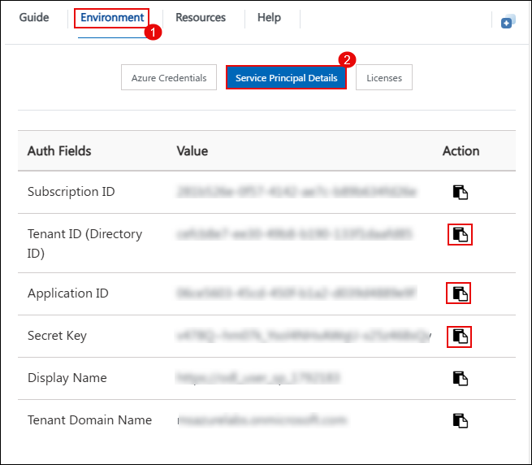
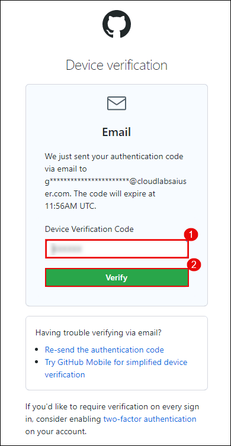
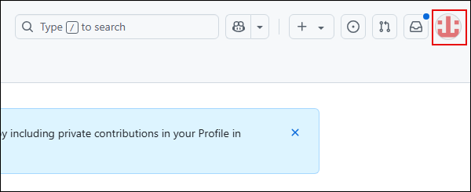
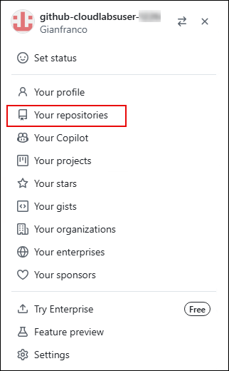
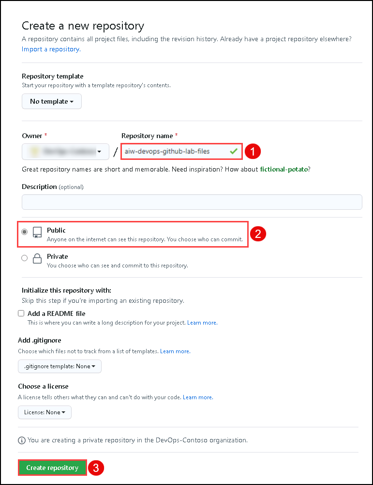
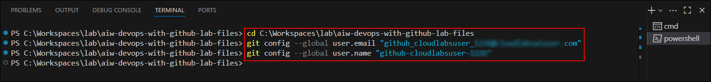
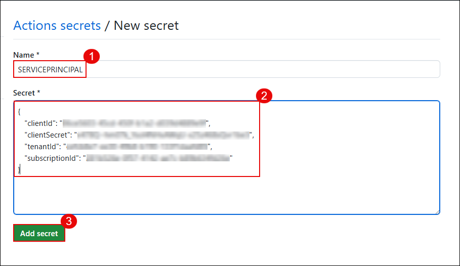

# Exercise 1: Continuous Integration and Continuous Deployment

### Estimated Duration: 140 Minutes

In this exercise, you will set up the local infrastructure for a cloud-native web application using .NET and Docker, and deploy it to Azure using GitHub Actions. You will also automate deployment workflows, configure GitHub secrets, and explore Codespaces for managing your project repository.

### Lab Objectives

In this exercise, you will:

- **Task 1: Access the lab files** using Visual Studio Code and explore the source code.
- **Task 2: Set up Local Infrastructure** using .NET and Docker to run services locally.
- **Task 3: Create the Project Repo** on GitHub and push the code from your local system.
- **Task 4: Build and push using GitHub Actions** to automate container builds and deployments.
- **Task 5: Editing the GitHub Workflow File using Codespace** to validate and customize CI/CD pipelines.

### Task 1: Access the lab files

In this task, you'll access and explore the code repository of the web app using Visual Studio Code. Visual Studio Code is a cross-platform, lightweight, but powerful source code editor.

1. From the VM desktop, double-click on the **Visual Studio Code** desktop icon to open the application.

   
   
1. In **Visual Studio Code**, click on the **menu bar (1)**, select **File (2)**, and then choose **Open Folder (3)** to browse the file system.

   

1. In the **Open Folder** window, navigate to the following path:  `C:\Workspaces\lab\aiw-devops-with-github-lab-files` **(1)**, Then click on **Select Folder (2)** to open the project.

   
    
1. If prompted with a trust warning, check the box **Trust the authors of all files... (1)** and click on **Yes, I trust the authors (2)** to continue.

   
   
1. You'll see the lab files in Visual Studio Code and explore the code files.

   

### Task 2: Set up Local Infrastructure

In this task, you will set up the local infrastructure using **.NET**. You'll be working with three Docker images: `fabrikam-init`, `fabrikam-api`, and `fabrikam-web`.
   
1. In **Visual Studio Code**, open a new terminal by clicking on the **menu bar (1)**, selecting **Terminal (2)**, and then choosing **New Terminal (3)**.

   
   
1. Click on the **drop-down** **(1)** button next to PowerShell and select **Command Prompt** **(2)**  from the list. A new Command Prompt terminal will be opened.   

   
   
1. Navigate to the **Environment (1)** details pane, click on **Service Principal Details (2)**, and copy the following values:

   - **Application ID (Client ID)**
   - **Secret Key (Client Secret)**
   -  **Tenant ID (Directory ID)** 
   
      
   
1. Update the **Application ID (Client ID)**, **Client Secret**, and **Tenant ID** in the command below, and run it in the terminal:

   ```pwsh
   az login --service-principal -u <clientId> -p <clientSecret> --tenant <tenantId>
   ```

   
   
1. Run the below-mentioned command to navigate to the `ContosoTraders.Api.Products` folder.

   ```pwsh
   cd C:\Workspaces\lab\aiw-devops-with-github-lab-files\src\ContosoTraders.Api.Products
   ```
   
      
   
1. Run `dotnet user-secrets set "KeyVaultEndpoint" "https://contosotraderskv<SUFFIX>.vault.azure.net/"` command to set secret path.

   >**Note:** Replace `<SUUFIX>` with **<inject key="DeploymentID" />** before running the command.

   
   
1. Run the below-mentioned command to build and host the carts locally.

   ```pwsh
   dotnet build && dotnet run --no-build
   ```  

    
   
   >**Note:** Please wait for 2 - 3 minutes for the build to complete.
   
1. Keep the terminal running. Open a new browser tab and try accessing the application using localhost port. You'll be able to see the output similar to the screenshot mentioned below.

   ```pwsh
   https://localhost:62300/swagger
   ```  

        
   
   > **Note:** If you are not able to access the application, click on **Advanced** under the "Your connection isn't private" warning.

    
   
   > **Note:** Then click on Continue to localhost(unsafe) to access the application.

      
   
1. Navigate back to **VS Code** and stop the terminal by typing **Ctrl + C**. Run the below-mentioned command to navigate to `ContosoTraders.Api.Carts` folder. 
  
   ```pwsh
   cd C:\Workspaces\lab\aiw-devops-with-github-lab-files\src\ContosoTraders.Api.Carts
   ```
  
        
   
1. Run `dotnet user-secrets set "KeyVaultEndpoint" "https://contosotraderskv<SUFFIX>.vault.azure.net/"` command to set secret path.

   
   
   >**Note:** Replace `<SUUFIX>` with **<inject key="DeploymentID" />** before running the command.
   
1. Run the below-mentioned command to build and host the carts locally.

   ```pwsh
   dotnet build && dotnet run --no-build
   ```    
  
    
   
   >**Note:** Please wait for 2 - 3 minutes for the build to complete.

1. Keep the terminal running. Open a new browser tab and try accessing the application using localhost port. You'll be able to see the output similar to the screenshot mentioned below.

   ```pwsh
   https://localhost:62400/swagger
   ```  

   
   
1. Navigate back to **VS Code** and stop the terminal by typing **Ctrl + C**.    
   
1. From the Windows taskbar, search for **Command Prompt** by typing **Command prompt (1)** in the search box, then click on **Command Prompt (2)** from the results to open it.

      
   
1. Run the below-mentioned command to navigate to `ContosoTraders.Ui.Website` folder. 
  
   ```pwsh
   cd C:\Workspaces\lab\aiw-devops-with-github-lab-files\src\ContosoTraders.Ui.Website
   ```
    
   
1. Run the below mentioned command to install npm.

   ```pwsh
   npm ci
   ```    
  
    
   
   >**Note:** Please wait until the installation completes. It will take around 10 - 15 minutes when you run npm install for the first time. In case the execution is stuck, please use **Ctrl + C** to stop the execution and retry the step.
   
1. Navigate back to **VS Code**, run the below-mentioned command to navigate to `ContosoTraders.Ui.Website` folder. 
  
   ```pwsh
   cd C:\Workspaces\lab\aiw-devops-with-github-lab-files\src\ContosoTraders.Ui.Website
   ```

1. Now run the following command to run ui of the application. This will automatically open a browser tab where you'll see the complete application running

   ```pwsh
   npm run start
   ```    
  
    
   
   >**Note:** It can take 5 - 10 minutes when you execute the command for the first time. You can continue with the next task and check on this step later.   
   
### Task 3: Create the Project Repo

In this task, you'll log in to GitHub and create a new repository to store the lab project files. You'll also configure repository settings and initialize it using Git from Visual Studio Code, preparing it for automated deployment through GitHub Actions.

1. In a new browser tab, go to `https://www.github.com/login` and save the copied credentials in Notepad. You’ll use them again during GitHub login and device verification steps.

   From the **Environment** tab **(1)** in the lab environment, click on the **Licenses (2)** button. Then, copy the **GitHub UserEmail (3)** and **GitHub Password (4)**.

   
 
1. Open an **InPrivate window** in Microsoft Edge by clicking the three-dot menu **(1)** in the top-right and selecting **New InPrivate window (2)**.

   

1. In the new InPrivate window, go to `http://outlook.office.com/`.

   

1. Enter your **GitHub username (1)** and click **Next (2)**.

   

1. Enter your **GitHub password (1)** and click **Sign in (2)**.

   

1. When prompted, click **No** on the **Stay signed in?** prompt.

   

1. Check your email inbox and copy the **verification code** sent by GitHub.

   

1. On the **Device verification** screen, enter the **Device verification code (1)** that was emailed to you and click **Verify (2)**.

    
    
1. In the upper-right corner of the GitHub dashboard, click on your **user avatar (1)** and select **Your repositories (2)** from the dropdown menu.

   
   
   

1. Next to the search criteria, locate and select the **New** button.

   

1. On the **Create a new repository** tab, name the repository **aiw-devops-with-github-lab-files (1)**, select **Public (2)**, and click the **Create repository (3)** button.

   
   
   >**Note:** If you observe any repository existing with the same name, please make sure you delete the Repo and create a new one. Please follow steps 12 to 16. Else, skip to step 17.

1. In the upper-right corner, expand the user **drop-down menu** ***(1)*** and select **Your repositories** ***(2)***.

   

1. Using the search bar, search for ```aiw-devops-with-github-lab-files``` **(1)** and select **aiw-devops-with-github-lab-files (2)**.

   

1. From the GitHub repository, click on the **Settings** tab.

   

1. In the settings page, scroll to the bottom of the page and select **Delete this repository**.

   

1. Are you absolutely sure? pop up window, Copy the **repository name** **(1)**, paste it in the **box** **(2)**, and cick on **I understand the consequences, delete this repository** **(3)**.

   

1. On the **Quick setup** screen, copy the **HTTPS** GitHub URL for your new repository, and **save it** in a notepad for future use.

   
   
1. From the GitHub username, note down the **Unique-ID** present in the Username. You'll use this value in upcoming steps.

    
   
1. Navigate back to the **Visual Studio Code** , ensure the terminal is open. Click on the **drop-down arrow (1)** next to the terminal tab, then select **PowerShell (2)** to open a new PowerShell terminal session.

    

1. In Visual Studio Code, open the terminal and navigate to the working directory:

   ```pwsh
   cd C:\Workspaces\lab\aiw-devops-with-github-lab-files

1. Run the following commands to configure your Git username and email. Replace the placeholder values with your GitHub account details:

   ```pwsh
   git config --global user.email "you@example.com"
   git config --global user.name "Your UserName"
   ```
   
   

1. Run the following commands in the terminal to initialize the folder as a Git repository and push the contents to the remote GitHub repository.  
Make sure to replace `<your_github_repository-url>` with the URL copied in Step 6 and `<Unique-ID>` from Step 7.

   ```pwsh
   git init
   git add .
   git commit -m "Initial commit"
   git branch -M main
   git remote add origin<Unique-ID> <your_github_repository-url>
   git push -u origin<Unique-ID> main
   ```

1. If you are asked to authenticate your GitHub account. Select **1. web browser**, and you will be prompted with a pop-up window to authorize Git Credential Manager. Click on **Authorize GitCredentialManager** to provide access

   
   > **Note:**After you are prompted with the message **Authorization Succeeded**, close the tab and continue with the next task.
     
### Task 4: Build and push using GitHub Actions

In this task, you will configure GitHub Codespaces to work with your project repository. Codespaces provides a cloud-hosted development environment directly within GitHub, allowing you to develop, build, and run your applications without needing local setup. You’ll open your project inside Codespaces, verify the environment configuration, and begin development using the pre-installed tools.

1. From the Azure Portal dashboard, click on **Resource groups** from the navigation panel to view all available resource groups.

    
   
1. Select **contoso-traders-<inject key="DeploymentID" enableCopy="false" />** resource group from the list.

     
   
1. From the list of resources in the selected resource group, click on the **productsdb** SQL database to open its overview page.

    
   
1. In the **productsdb** page, expand **Settings (1)** from the left-hand menu, then select **Connection strings (2)**.  Under the **ADO.NET (3)** tab, copy the **ADO.NET (SQL authentication)** connection string by clicking the **copy icon (4)**.

     
 
1. In your GitHub lab files repository, select the **Settings** tab from the lab files repository.

   
   
1. Under **Security**, expand **Secrets and variables (1)** by clicking the drop-down and select **Actions (2)** blade from the left navigation bar. Select the **New repository secret (3)** button.

   
    
1. On the **Actions secrets / New secret** page, fill in the following details and click on **Add secret (3):**

   - **Name:** Enter **SQL_PASSWORD (1)**
   - **Secret:** Paste the **ADO.NET (SQL authentication) (2)** connection string copied in the previous step.
   
      
   
      >**Note:** Replace `{your_password}` with the ODL User Azure Password. Go to **Environment Details (1)**, click on **Azure credentials (2)**, and copy **Password (3)**.
   
         
   
1. Navigate to the **Environment (1)** tab and click on **Service Principal Details (2)**. From the list, copy the following fields:

   - **Subscription ID**
   - **Tenant ID (Directory ID)**
   - **Application ID (Client ID)**
   - **Secret Key (Client Secret)**

      
   
   - Replace the values that you copied below with JSON. You will be using them in this step.
   
      ```json
      {
         "clientId": "zzzzzzzz-zzzz-zzzz-zzzz-zzzzzzzzzzzz",
         "clientSecret": "client-secret",
         "tenantId": "zzzzzzzz-zzzz-zzzz-zzzz-zzzzzzzzzzzz",
         "subscriptionId": "zzzzzzzz-zzzz-zzzz-zzzz-zzzzzzzzzzzz"
      }
      ```
   
1. Under **Actions Secrets/New secret** page, enter the below-mentioned details and click on **Add secret (3)**

   - **Name :** Enter **SERVICEPRINCIPAL (1)**
   - **Value :** Paste the service principal details in json format **(2)**
   
      
   
1. Under **Actions Secrets/New secret** page, enter the below-mentioned details and click on **Add secret (3)**

   - **Name :** Enter **ENVIRONMENT (1)**.
   - **Value : ** **<inject key="DeploymentID" enableCopy="false" />** **(2)**.
   
      
   
1. From your GitHub repository, select the **Actions (1)** tab. Select the **contoso-traders-app-deployment (2)** workflow from the side blade, click on the  **drop-down (3)** next Run workflow button, and select **Run workflow (4)**.

   
   
1. Navigate back to the Actions tab and select the **contoso-traders-app-deployment** workflow. This workflow builds the Docker image, which is pushed to the container registry. The same image is pushed to the Azure container application.

   
   
   
   
   **Note:** If the workflow **fails** due to **npm install** job, follow from step 13 - step 16. Else, continue from step 17. 
   
1. From the GitHub browser tab, follow the steps given below and click on **Create codespace on main** ***(3)***.

   - click on **Code** ***(1)***, 
   - Select the **Codespace** ***(2)*** tab

      
   
1. Run the below-mentioned commands in the **Terminal**. You'll set node version to node 14.

   ```pwsh
   cd src
   cd ContosoTraders.Ui.Website
   nvm install 14
   nvm use 14
   npm i
   git add . 
   git commit -m "updated node version"
   git push
   ```
    
1. From your GitHub repository, select **Actions (1)** tab. You'll see an Action named **Updated node version (2)** executing. Please wait until the execution completes

   
   
         
   
1. Navigate to the Azure Portal, click on Resource groups from the Navigate panel to see the resource groups.

    
   
1. Select **contoso-traders-<inject key="DeploymentID" enableCopy="false" />** resource group from the list.

    
   
1. Select **contoso-traders-ui2<inject key="DeploymentID" enableCopy="false" />** endpoint from the list of resources.

    
   
1. Click on **Endpoint hostname**. It'll open a browser tab where you will see that the Contoso Traders app has been hosted successfully.

    
    
    
    
### Task 5: Editing the GitHub Workflow File using Codespace

 In this task, you will manually trigger the GitHub Actions workflow to deploy the application using the configuration and secrets added in the previous steps. You will monitor the workflow run, examine the logs for each job, and validate that the deployment completes successfully. This step ensures your CI/CD pipeline is correctly configured and functional.

1. From the GitHub browser tab, follow the steps given below and click on **Create codespace on main (3)**.

   - click on **Code (1)**, 
   - Select the **Codespace (2)** tab.

      
   
      >**Note:** In case you had created a codespace in the previous task. Click on the **+** button to create a new codespace.
   
1. You'll be redirected to a new codespace tab in the browser. Please wait until the codespace is configured.

   
   
1. From the explorer side blade, navigate to **.github (1)** > **workflows** **(2)** and select **contoso-traders-provisioning-deployment.yml** **(3)** file.

    
   
1. Remove the commands from lines 7 to 14 from the workflow file.

   
    
   
1. Using the terminal from Codespace, run the following commands to commit this change to your repo and to push the change to GitHub.

   ```pwsh
   git add .
   git commit -m "Updating app deployment"
   git push
   ```
    
    
   > **Note:** This will update the workflow and will **not** run the "Update the ... Docker image" jobs.

1. Navigate back to the GitHub browser, Under the Actions tab, and review the **workflow**  created automatically for the changes made. 

   

1. Click on the **Next** button present in the bottom-right corner of this lab guide.

   

## Summary

In this exercise, you configured a local development environment, created a GitHub repository, and set up secrets and credentials. You deployed the application to Azure using GitHub Actions and verified the deployment. You also used GitHub Codespaces to update and manage the CI/CD workflow.
   
   
