# Exercise 2: Monitoring and Load Testing

### Estimated Duration: 100 Minutes

In this exercise, you will monitor application health using Application Insights, configure Azure Load Testing to simulate traffic, and explore Azure Chaos Studio to assess application resilience. These steps will help you analyze performance under load and evaluate how your system responds to real-world faults.

### Lab Objectives

In this exercise, you will:

- **Task 1: Monitoring using Application Insights** to analyze key metrics like failed requests, response times, and availability.
- **Task 2: Set up Load Testing** by creating an Azure Load Testing instance and running a simulated URL-based test.
- **Task 3: Explore Chaos Studio** to inject faults into your application using Azure Chaos Studio and evaluate system resilience.

## Task 1: Monitoring using Application Insights

In this task, you will explore telemetry data captured by Application Insights. You'll review key metrics such as failed requests, server response time, server requests, and availability to monitor the health and performance of your application.

1. On the **Azure Portal**, navigate to the **contoso-traders-<inject key="DeploymentID" />** **(1)** resource group and select the Application Insights resource named **contoso-traders-ai<inject key="DeploymentID" />** **(2)**.

   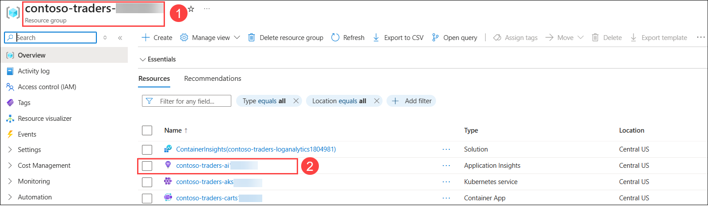
   
1. On the **Application Insights** page, click **Overview (1)** from the left menu. Then, under **Show data for last:**, click **6 hours** **(2)** to see data from the last six hours.

   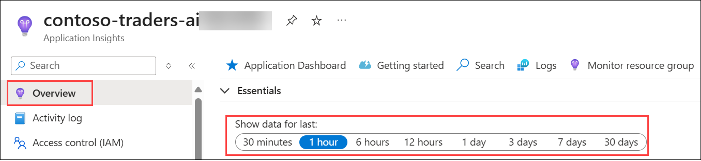
   
1. In the first graph, you can see the number of failed requests for the Application access.

   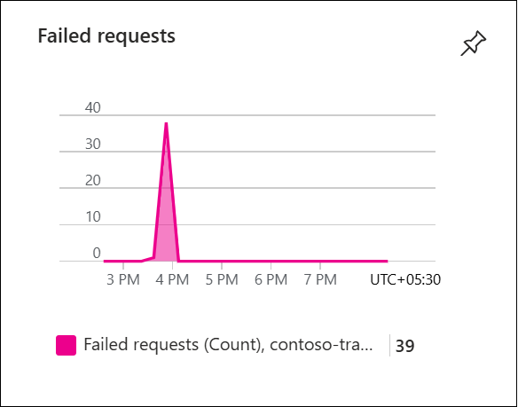
   
1. In the next graph, you can see the average server response time.

   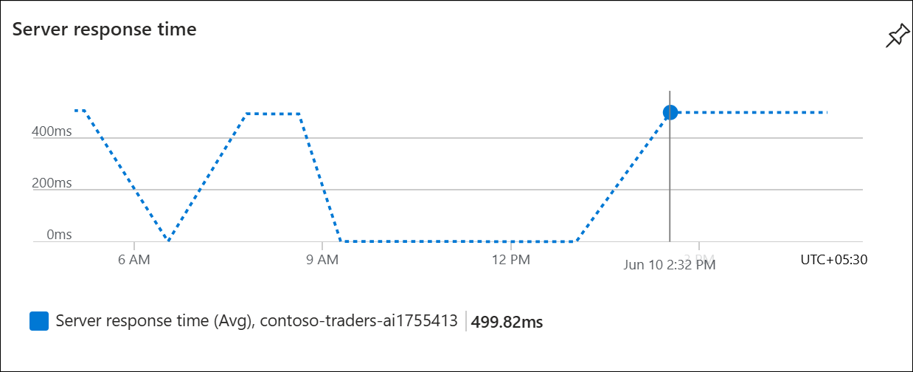
   
1. In the next graph, you can see the number of server requests.

   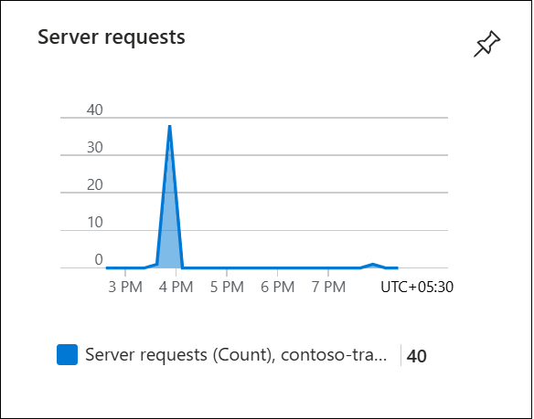
   
1. In the last graph, you can see the average availability.

   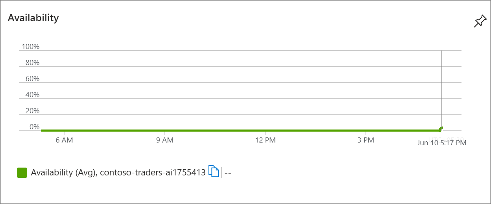

> **Congratulations** on completing the task! Now, it's time to validate it. Here are the steps:
> - If you receive a success message, you can proceed to the next task.
> - If not, carefully read the error message and retry the step, following the instructions in the lab guide.
> - If you need any assistance, please contact us at cloudlabs-support@spektrasystems.com. We are available 24/7 to help you out.

<validation step="1706630b-9fc0-4c4d-880b-633d75befef6" />

## Task 2: Set up Load Testing

In this task, you will create an Azure Load Testing instance and run a quick URL-based test using your application’s endpoint. This will help evaluate how your application performs under simulated load conditions.

1. On the **Azure Portal**, navigate to the **contoso-traders-<inject key="DeploymentID" />** resource group  and select the Front Door resource named **contoso-traders-cdn<inject key="DeploymentID" />**. Copy the  **Endpoint** resource named **contoso-traders-ui2<inject key="DeploymentID" />** and paste it into Notepad for later use.

      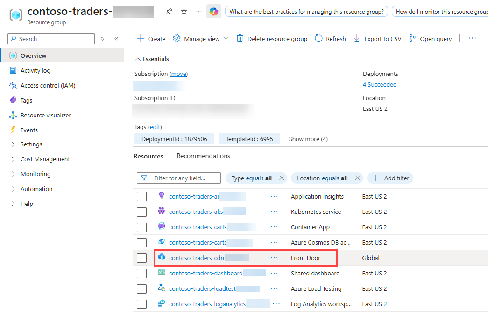

      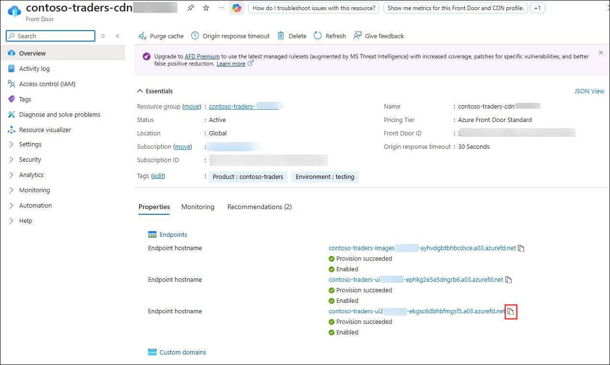

1. On the **Azure Portal**, navigate to the **contoso-traders-<inject key="DeploymentID" />** **(1)** resource group and select the **Azure Load Testing** resource named **contoso-traders-loadtest<inject key="DeploymentID" />** **(2)**.

      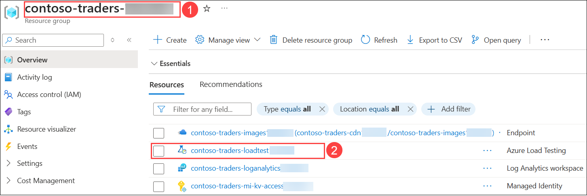
   
1. On the **Azure Load Testing** resource page, go to the left-hand menu and select **Tests** **(1)** under the Tests section. Then, click **+ Create** **(2)** and choose **Create a quick test** **(3)**.

      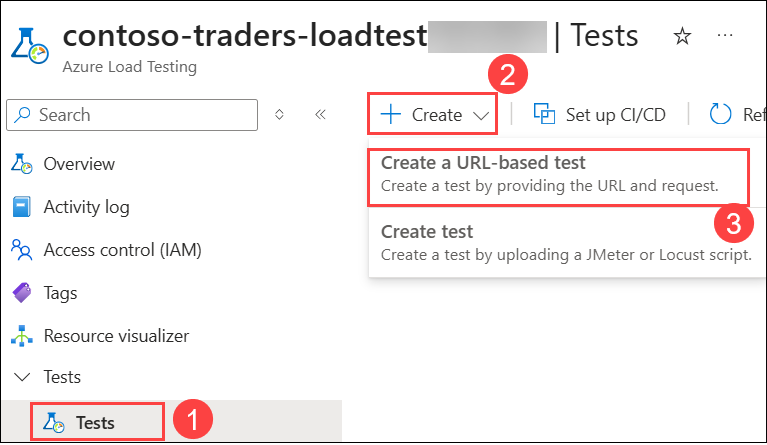

1. On the **Create a URL-based test** page, under the **Basics** tab, uncheck the option for **Enable advanced settings** and configure the following settings:

   - Set **Test name** to a name of your choice **(1)**.
   - Enter the **Test URL** using the copied endpoint hostname **(2)**.
   - Set **Number of virtual users** to `5` **(3)**.
   - Set **Test duration** to `2` minutes **(4)**.
   - Set **Ramp-up time** to `0` minutes **(6)**.
   - Click on **Review + create** **(7)** and click on **Create**. 

        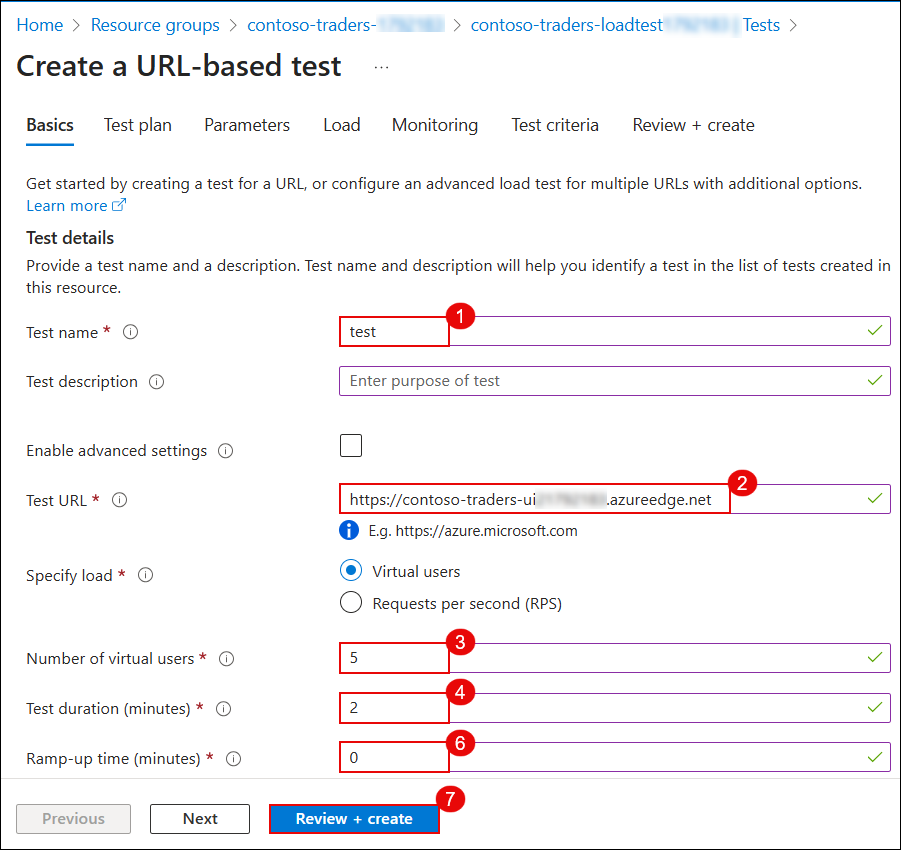

1. The test run will start running, and once the test run is completed, you will be able to see **Client-side metrics**. Explore the given metrics output.

      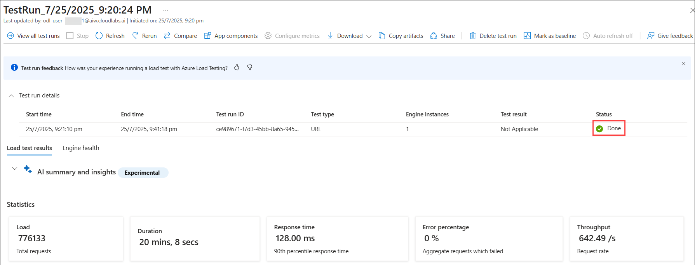
   
   >**Note:** In case the test fails due to `The test was stopped due to a high error rate. Check your script and try again. In case the issue persists, raise a ticket with the support team. This is expected as sometimes the load on the application exceeds the defined throughput.

> **Congratulations** on completing the task! Now, it's time to validate it. Here are the steps:
> - If you receive a success message, you can proceed to the next task.
> - If not, carefully read the error message and retry the step, following the instructions in the lab guide.
> - If you need any assistance, please contact us at cloudlabs-support@spektrasystems.com. We are available 24/7 to help you out.

<validation step="f438e274-8872-461d-85c7-4aa4a9a261e6" />

## Task 3: Explore Chaos Studio

In this task, you will add **Targets** and create an **Experiment** on **Azure Chaos Studio** to check the resilience of the web application that we created by adding real faults and observe how our applications respond to real-world disruptions.

1. On the **Azure Portal**, use the search bar to search for **Chaos Studio** **(1)**, and select **Chaos Studio** **(2)** from the search results.

   

1. On the **Chaos Studio** page, from the left-hand menu, select **Targets** **(1)** under **Experiment management** section. Then, in the resource group dropdown, select **contoso-traders-<inject key="DeploymentID" enableCopy="false" />** **(2)**.

   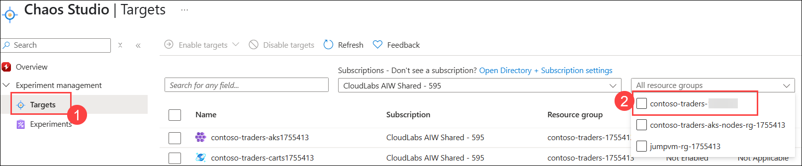

1. Click on the **contoso-traders-aks<inject key="DeploymentID" enableCopy="false" />** **(1)** Kubernetes service instance. From the **Enable Targets** **(2)** dropdown, select **Enable service-direct targets (All resources)** **(3)**.

   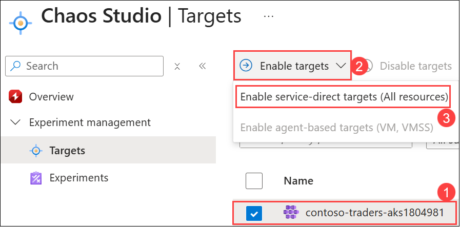

1. Select the checkbox for **contoso-traders-aks<inject key="DeploymentID" enableCopy="false" />** **(1)** and click **Review + Enable** **(2)**.

   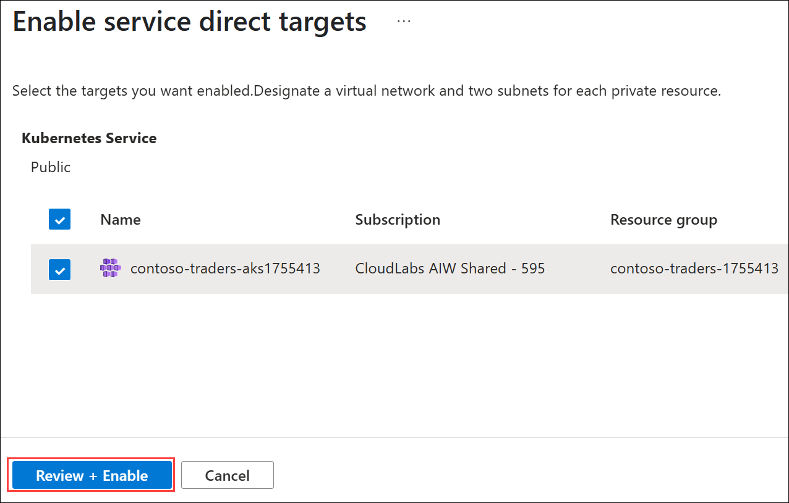

1. Then click on **Enable** to enable service direct targets.

   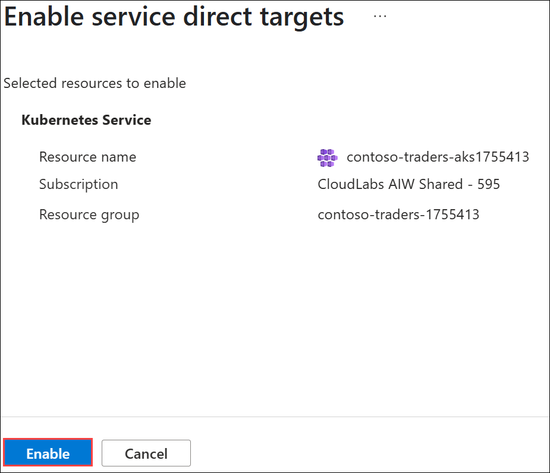

1. Wait for the deployment to be completed.

1. In the **Azure Portal**, use the search bar to search for **Chaos Studio (1)** , and select it from the search results **(2)**.

   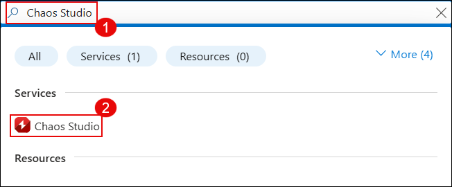

1. Once the target is enabled, select **Experiments** **(1)** under **Experiment management** section from the left-hand menu. Click on **+ Create** **(2)** and select **New experiment** **(3)**.

   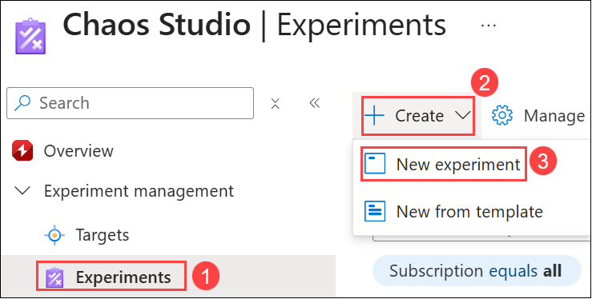

1. On the **Create an experiment** page, under the **Basics** tab, provide the following values and click **Next : Permissions (5) >>**:

   - **Subscription:** Select your default subscription **(1)**
   - **Resource group:** contoso-traders-<inject key="DeploymentID" enableCopy="false" /> **(2)**
   - **Name:** contoso-chaos-<inject key="DeploymentID" enableCopy="false" /> **(3)**
   - **Region:** Leave it to default **(4)**

     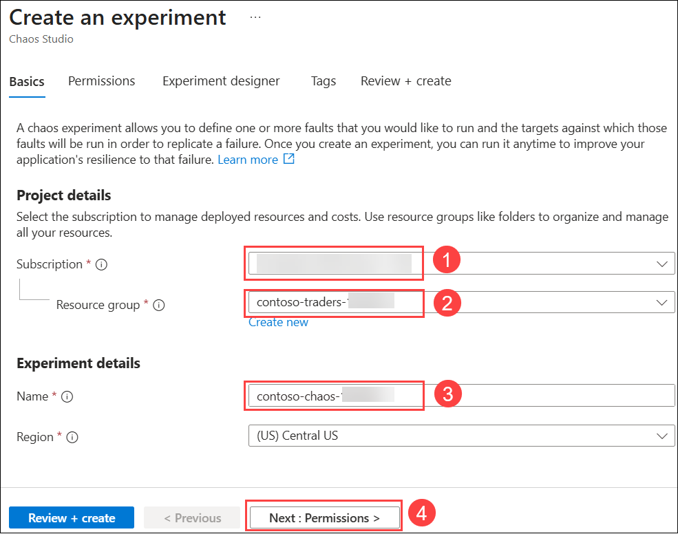

1. On the **Permissions** tab:
   - Select **System assigned identity** **(1)** under Managed identities.
   - Choose **Assign experiment permissions manually** **(2)** under Experiment permissions
   - Click on **Next : Experiment designer >** **(3)**

      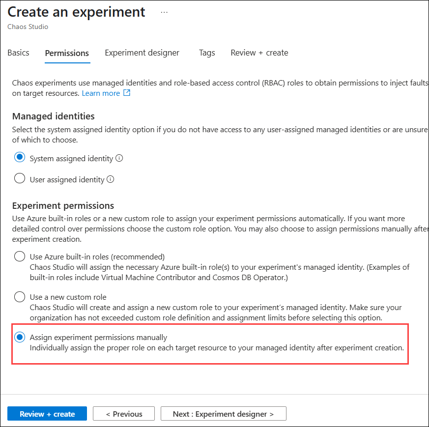

1. On the **Experiment designer** page select **+ Add action (1)** and choose **Add fault (2)**.

   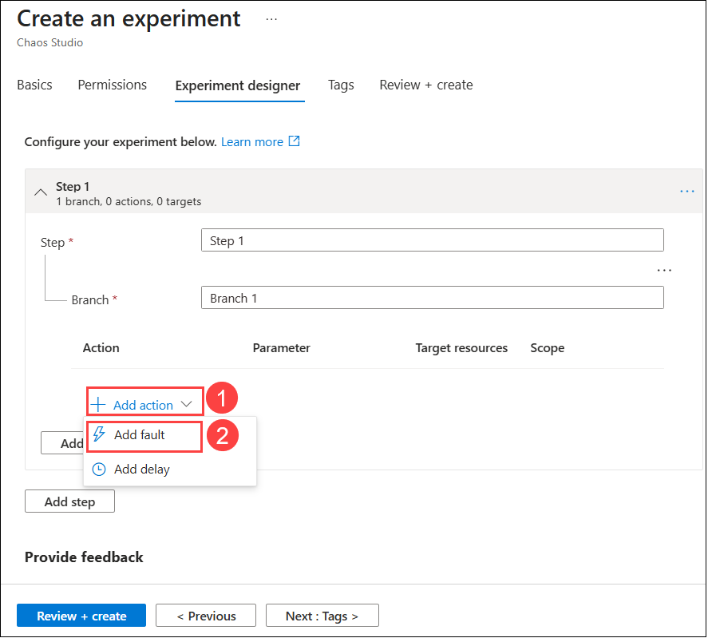

1. On the **Add fault** page:

   - Select the fault type: **AKS Chaos Mesh Pod Chaos (deprecated)** **(1)**
   - Set the **Duration (minutes)** to `5` **(2)**
   - Click **Next : Target resources >>** **(3)**

      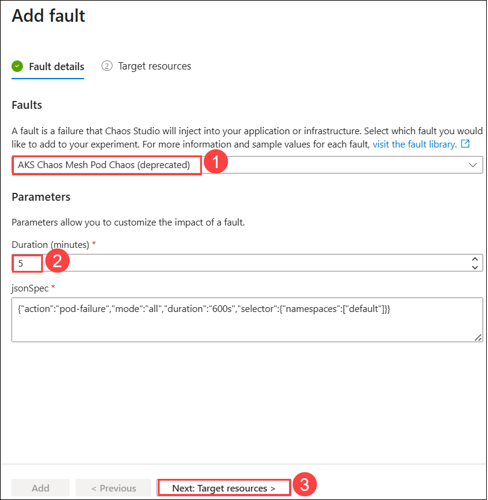

1. On the **Target resources** tab:
   - Select **Manually select from a list** **(1)** under Select target resources.
   - Check the box for **contoso-traders-aks<inject key="DeploymentID" enableCopy="false" />** **(2)** resource
   - Click on **Add** **(3)**

      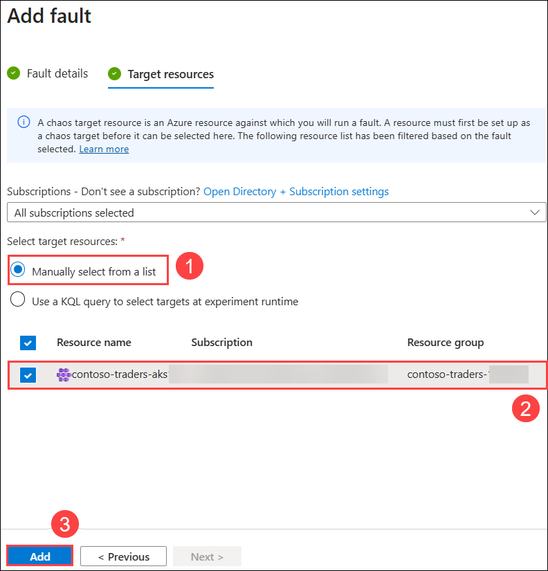

1. Click on **Review + create**.

   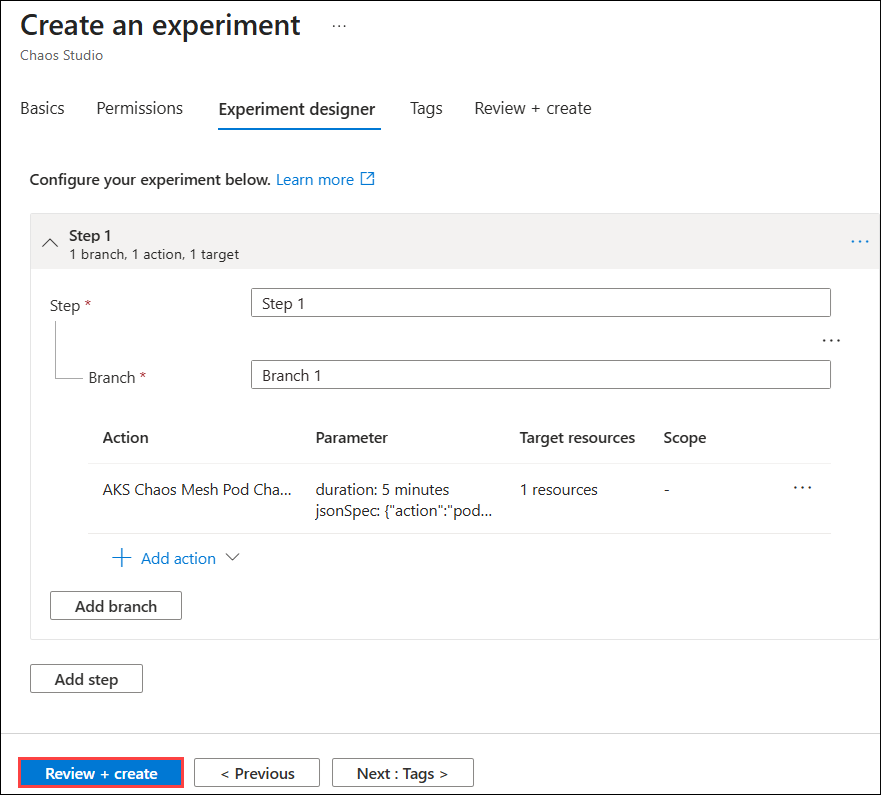

1. On the **Review + create** page, click on **Create**.

   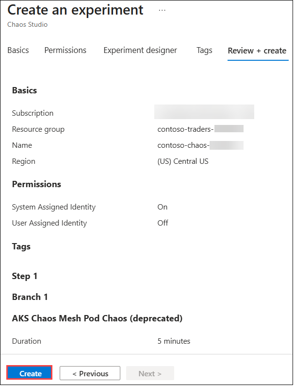

1. Navigate back to the **contoso-traders-aks<inject key="DeploymentID" enableCopy="false" />** Kubernetes service.

   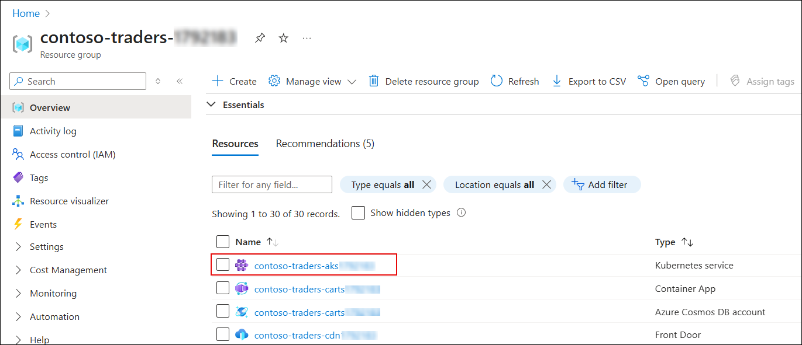

1. Select **Access control (IAM) (1)** from the left navigation pane, click on **+ Add (2)** and select **Add role assignment (3)**.

   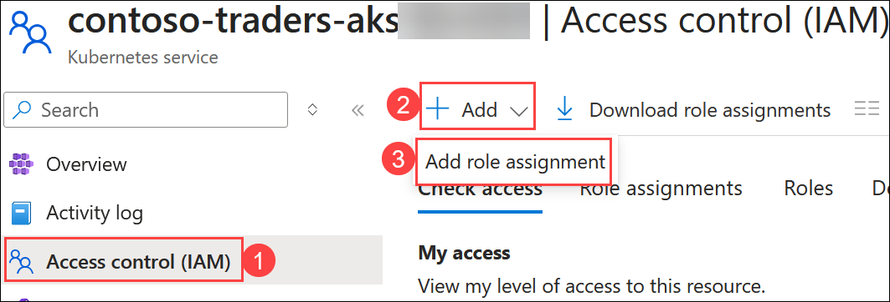

1. On the **Add role assignment** page:

   - Make sure the **Role** tab is selected **(1)**
   - Select **Privileged administrator roles** **(2)**
   - Choose the **Owner** role from the list **(3)**
   - Click on **Next** **(4)**

      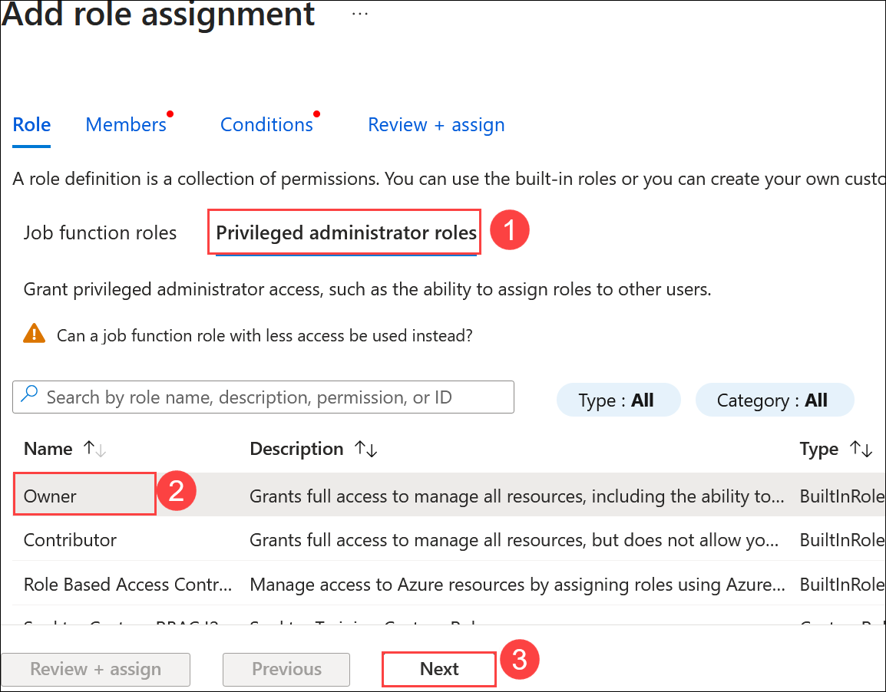

1. On the **Members** tab, select **Managed identity** **(1)** for **Assign access to**, then click **+ Select members** **(2)** under **Members**. In the **Select managed identities** pane, choose **Chaos Experiment** **(3)**, select the experiment **contoso-chaos-<inject key="DeploymentID" enableCopy="false" />** **(4)**, click **Select** **(5)**, and then click **Next** **(6)** to continue.

   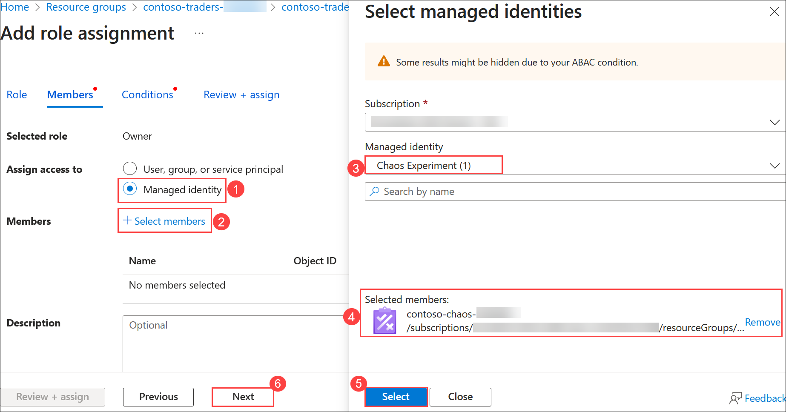

1. Next on the **Conditions** tab select **Allow user to assign all roles (highly privileged)** **(1)** and click on **Review + assign** **(2)**.

   

1. Click on **Review + assign**.

   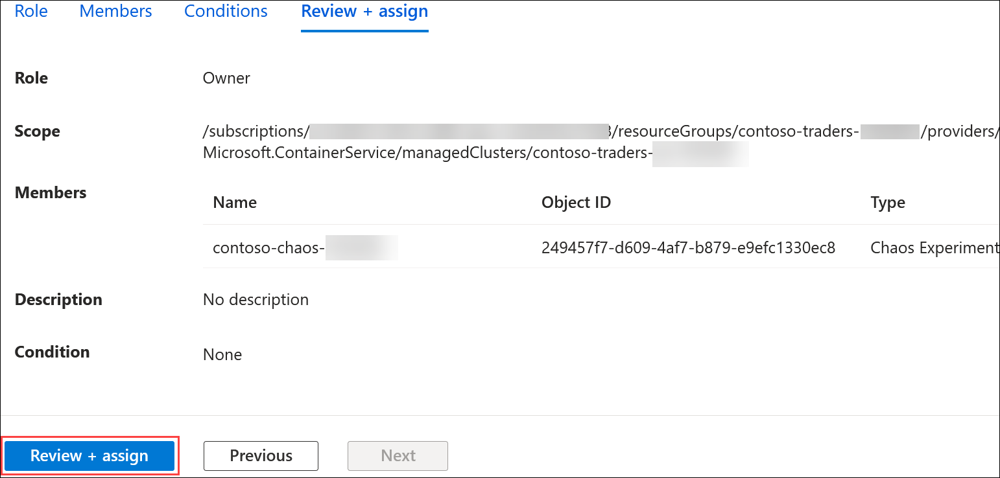

1. On the Azure portal, navigate back to the Chaos experiment you created **contoso-chaos-<inject key="DeploymentID" enableCopy="false" />** and click on **Start**.

   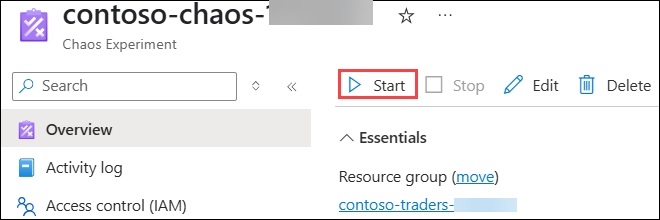

1. Select **Ok** for **Start this experiment** pop-up.

   

1. Once the experiment status is **Success** click on **Details** to view the run preview.

   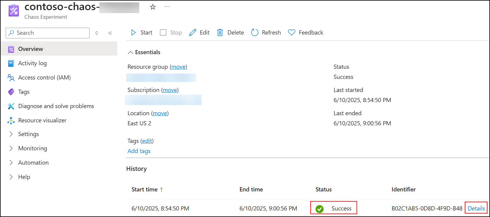

1. On the **Details** preview page select **Action (1)** and view the complete detail of the run on **Fault details** under **Successful targets (2)**.
 
   

> **Congratulations** on completing the task! Now, it's time to validate it. Here are the steps:
> - If you receive a success message, it means you have successfully completed the lab.
> - If not, carefully read the error message and retry the step, following the instructions in the lab guide. 
> - If you need any assistance, please contact us at cloudlabs-support@spektrasystems.com. We are available 24/7 to help you out.

<validation step="f10df9c1-cfa8-4291-b7c0-8e8951e65d13" />

## Summary

In this exercise, you monitored application performance using Application Insights, simulated traffic using Azure Load Testing, and used Chaos Studio to evaluate the resilience of your application under real-world fault conditions. These tools help ensure your application is performant, stable, and fault-tolerant under load and disruption.

## You have successfully completed the Hands-on lab!
