# Exercise 2: Monitoring and Load Testing

### Estimated Duration: 100 minutes

In this exercise, you will monitor application health using Application Insights, configure Azure Load Testing to simulate traffic, and explore Azure Chaos Studio to assess application resilience. These steps will help you analyze performance under load and evaluate how your system responds to real-world faults.

### Task 1: Monitoring using Application Insights

In this task, you will explore telemetry data captured by Application Insights. You'll review key metrics such as failed requests, server response time, server requests, and availability to monitor the health and performance of your application.

1. On the **Azure Portal**, navigate to the **contoso-traders-<inject key="DeploymentID" />** resource group **(1)** and select the **Application Insights** resource named **contoso-traders-ai<inject key="DeploymentID" />** **(2)**.

   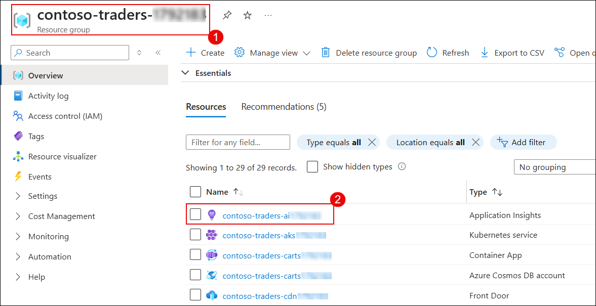
   
1. On the **Overview** pane of the **contoso-traders-ai<inject key="DeploymentID" />** Application Insights resource **(1)**, use the **Show data for last** dropdown **(2)** to filter the monitoring data by a specific time range.

   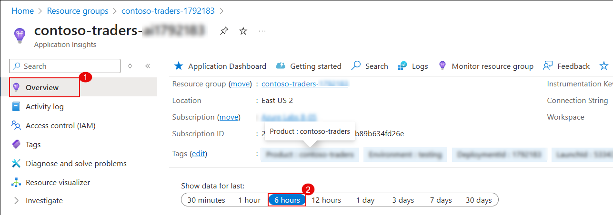
   
1. In the first graph, you can see the number of failed requests for the Application access.

   
   
1. In the next graph, you can see the average server response time.

   
   
1. In the next graph, you can see the number of server requests.

   
   
1. In the last graph, you can see the average availability.

     
   
## Task 2: Set up Load Testing

In this task, you will create an Azure Load Testing instance and run a quick URL-based test using your application’s endpoint. This will help evaluate how your application performs under simulated load conditions.

1. On the **Azure Portal**, navigate to the **contoso-traders-<inject key="DeploymentID" />** resource group **(1)** and select the **Endpoint** resource named **contoso-traders-ui2<inject key="DeploymentID" />** **(2)**.

   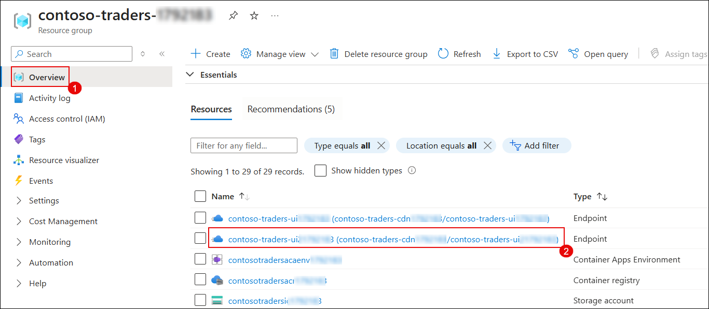

1. On the **Overview** pane of the **contoso-traders-ui2<inject key="DeploymentID" />** endpoint **(1)**, copy the **Endpoint hostname** value **(2)** and save it in Notepad for later use in this task.

   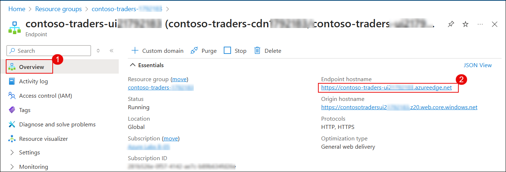

1. On the **Azure Portal**, navigate to the **contoso-traders-<inject key="DeploymentID" />** resource group **(1)** and select the **Azure Load Testing** resource named **contoso-traders-loadtest<inject key="DeploymentID" />** **(2)**.

   
   
1. On the **Azure Load Testing** resource page, from the left-hand menu, select **Tests** **(1)**. Then click on **+ Create** **(2)** and choose **Create a quick test** **(3)**.

   

1. On the **Create a URL-based test** page, under the **Basics** tab, configure the following settings:

   - Set **Test name** to a name of your choice **(1)**.
   - Enter the **Test URL** using the copied endpoint hostname **(2)**.
   - Set **Number of virtual users** to `5` **(3)**.
   - Set **Test duration** to `2` minutes **(4)**.
   - Set **Ramp-up time** to `0` minutes **(6)**.
   - Leave **Enable advanced settings** unchecked.
   - Click on **Review + create** **(7)**.

   

1. The test run will start running, and once the test run is completed, you will be able to see **Client-side metrics**. Explore the given metrics output.

   
   
   **Note:** In case the test fails due to `The test was stopped due to a high error rate. Check your script and try again. In case the issue persists, raise a ticket with support team. This is expected as sometimes the load on the application exceeds the defined throughput.
     
## Task 3: Explore Chaos Studio

In this task, you will add **Targets** and create an **Experiment** on **Azure Chaos Studio** to check the resilience of the web application that we created by adding real faults and observe how our applications respond to real-world disruptions.

1. On the **Azure Portal**, use the search bar **(1)** to search for **Chaos Studio**, and select it from the search results **(2)**.

   

1. On the **Chaos Studio** page, from the left-hand menu, select **Targets** **(1)**. Then, in the resource group dropdown, select **contoso-traders-<inject key="DeploymentID" enableCopy="false" />** **(2)**.

   

1. Click on the **contoso-traders-aks<inject key="DeploymentID" enableCopy="false" />** Kubernetes service instance **(1)**. From the **Enable Targets** dropdown **(2)**, select **Enable service-direct targets (All resources)** **(3)**.

   

1. Select the checkbox next to **contoso-traders-aks<inject key="DeploymentID" enableCopy="false" />** **(1)** and click **Review + Enable** **(2)**.

   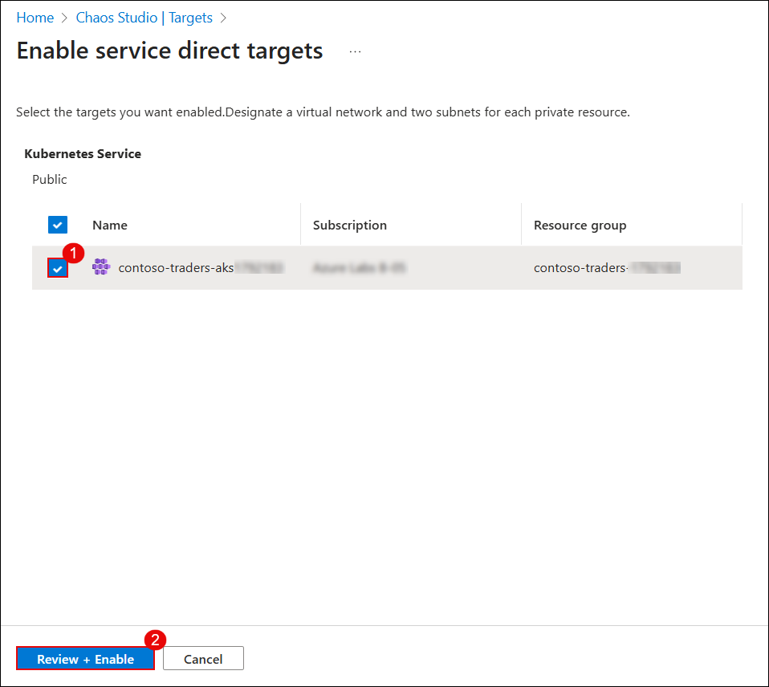

1. Then click on **Enable** to enable service direct targets.

   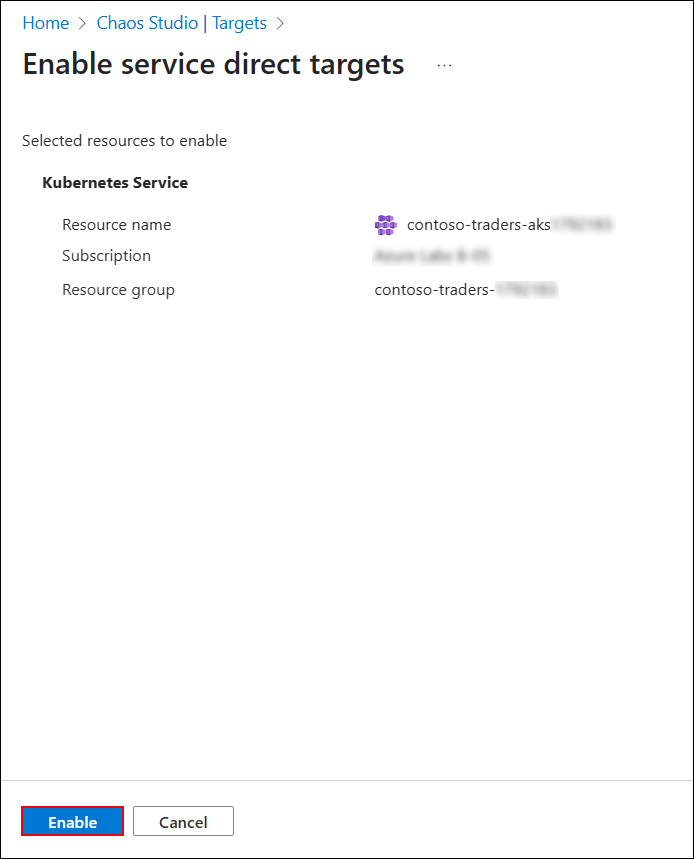

1. Wait for the deployment to be completed.

1. In the **Azure Portal**, use the search bar **(1)** to search for **Chaos Studio**, and select it from the search results **(2)**.

   

1. Once the target is enabled, select **Experiments** **(1)** from the left-hand menu. Click on **+ Create** **(2)** and select **New experiment** **(3)**.

   

1. On the **Create an experiment** page, under the **Basics** tab, provide the following values and click **Next: Permissions (5)**:

   - **Subscription:** Select your default subscription **(1)**
   - **Resource group:** **contoso-traders-<inject key="DeploymentID" enableCopy="false" />** **(2)**
   - **Name:** **contoso-chaos-<inject key="DeploymentID" enableCopy="false" />** **(3)**
   - **Region:** Leave it to default **(4)**

     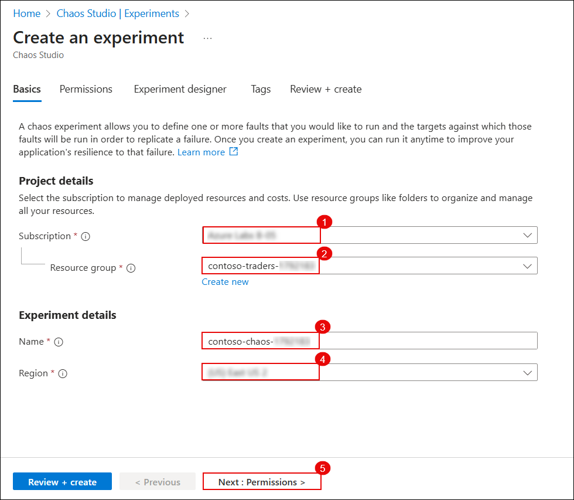

1. On the **Permissions** tab:
   - Select **System assigned identity** **(1)**
   - Choose **Assign experiment permissions manually** **(2)**
   - Click **Next: Experiment designer >** **(3)**

   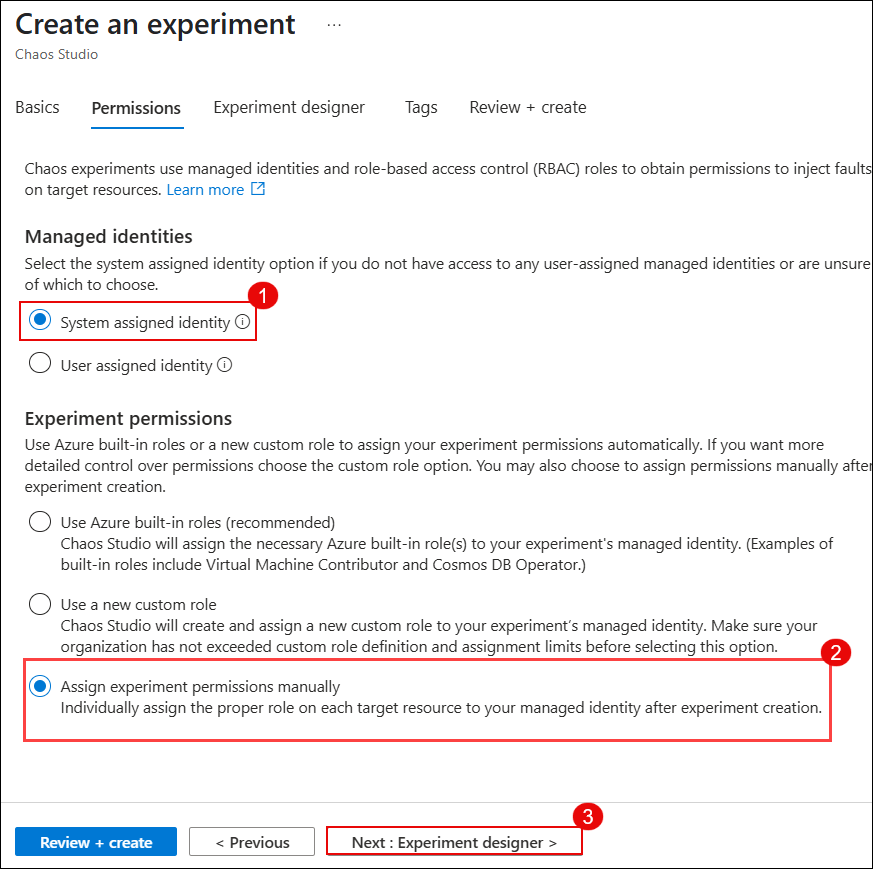

1. On the **Experiment designer** page select **+ Add action (1)** and choose **Add fault (2)**.

   

1. On the **Add fault** page:

   - Select the fault type: **AKS Chaos Mesh Pod Chaos (deprecated)** **(1)**
   - Set the **Duration (minutes)** to `5` **(2)**
   - Click **Next: Target resources >** **(3)**

      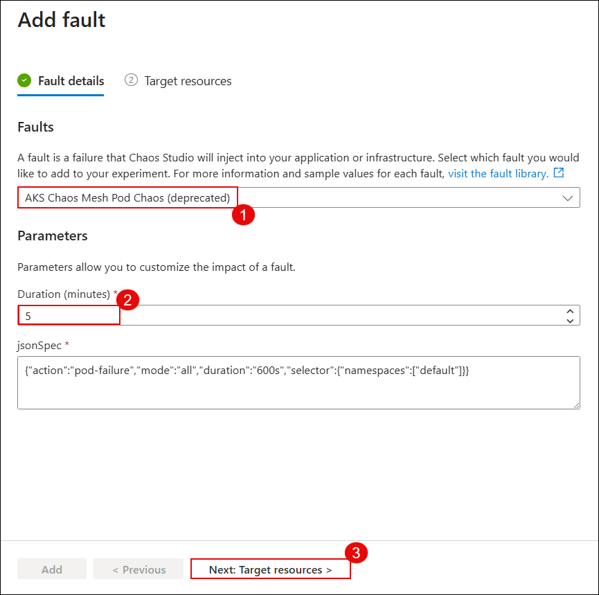

1. On the **Target resources** tab:
   - Select **Manually select from a list** **(1)**
   - Check the box for **contoso-traders-aks<inject key="DeploymentID" enableCopy="false" />** **(2)**
   - Click **Add** **(3)**

   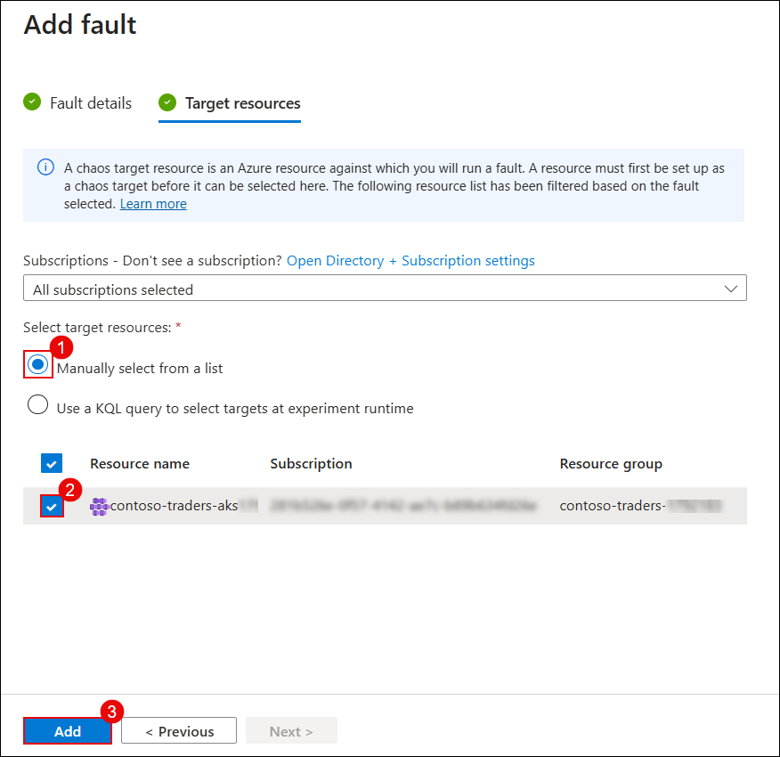

1. Click on **Review + create**.

   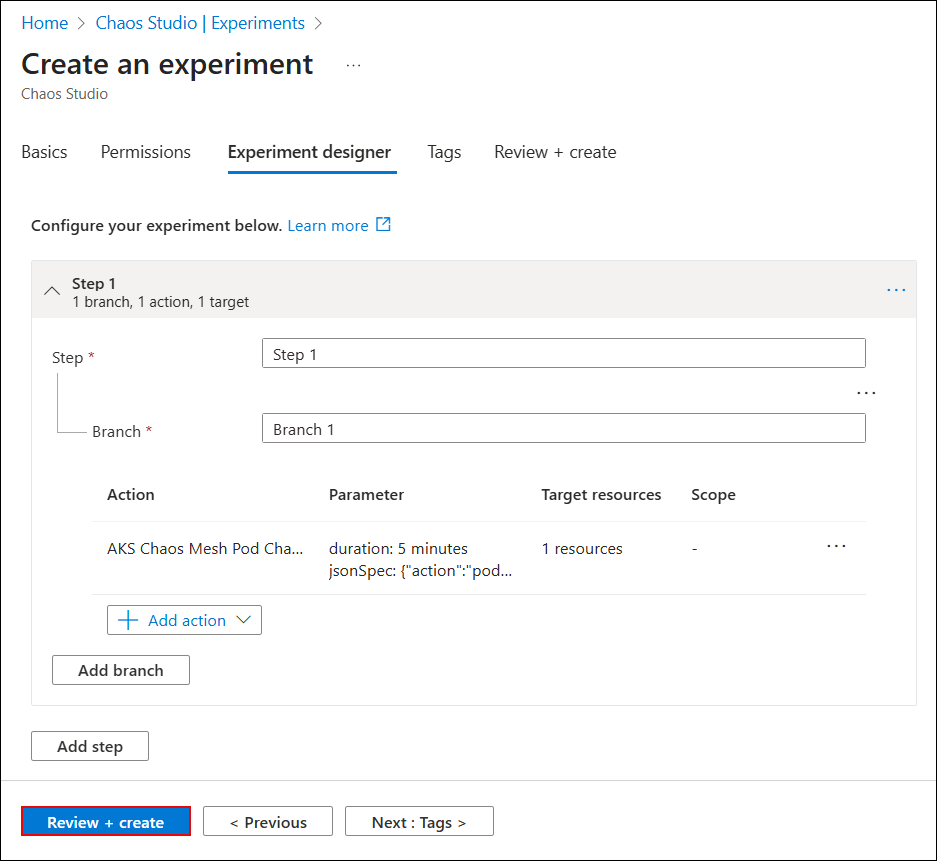

1. On the **Review + create** click on **Create**.

   

1. Navigate back to the **contoso-traders-aks<inject key="DeploymentID" enableCopy="false" />** container instance.

   

1. Select **Access control (IAM) (1)** from the left navigation pane, click on **+ Add (2)** and select **Add role assignment (3)**.

   

1. On the **Add role assignment** page:

   - Make sure the **Role** tab is selected **(1)**
   - Under **Job function roles**, select **Privileged administrator roles** **(2)**
   - Choose the **Owner** role from the list **(3)**
   - Click **Next** **(4)**

   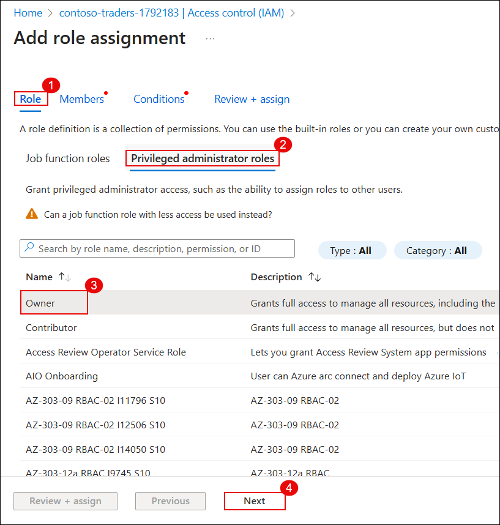

1. Next on the **Members** tab select **Managed identity (1)** for **Assign access to** , click on **+ Select members (2)** on the **Select managed identities** choose **Chaos Experiment (3)** for **Managed identity** select the experiment **contoso-chaos-<inject key="DeploymentID" enableCopy="false" /> (4)**, click on **Select (5)** and click on **Next** **(6)**.

   

1. Next on the **Conditions** tab select **What user can do** as **Allow user to assign all roles (highly privileged)** **(1)** and click on **Review + assign** **(2)**.

   

1. Click on **Review + assign**.

   

1. On the Azure portal, navigate back to the Chaos experiment you created **contoso-chaos-<inject key="DeploymentID" enableCopy="false" />** and click on **Start**.

   

1. Select **Ok** for **Start this experiment** pop-up.

   

1. Once the experiment status is **Success** click on **Details** to view the run preview.

   

1. On the **Details** preview page select **Action (1)** and view the complete detail of the run on **Fault details** under **Successful targets (2)**.
 
   

## Summary

In this exercise, you monitored application performance using Application Insights, simulated traffic using Azure Load Testing, and used Chaos Studio to evaluate the resilience of your application under real-world fault conditions. These tools help ensure your application is performant, stable, and fault-tolerant under load and disruption.

## You have successfully completed the lab!
