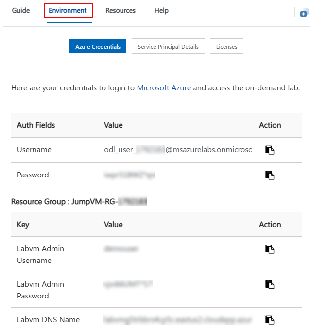
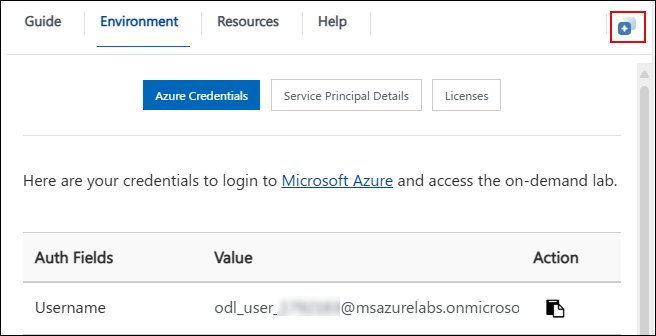
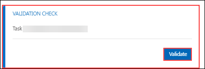
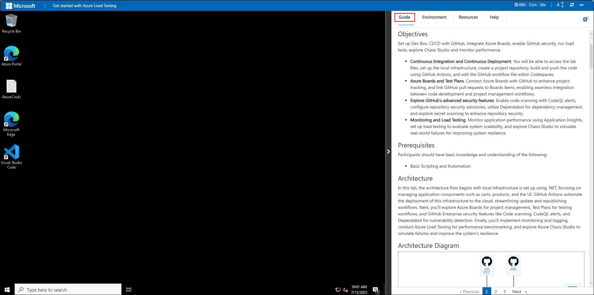
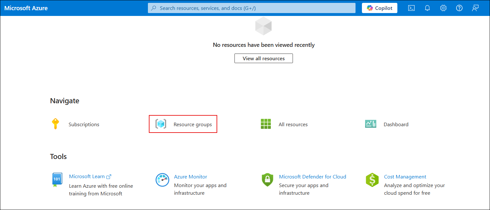
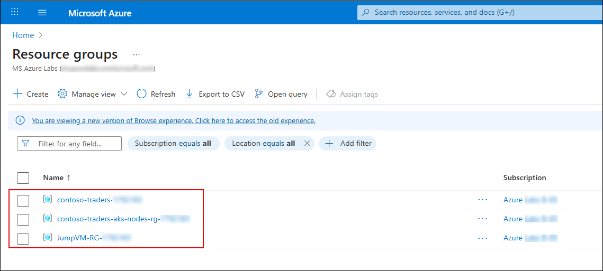

# Get started with Azure Load Testing 

### Overall Estimated Duration: 8 Hours

## Overview

In this lab, you'll get hands-on with Azure Load Testing, a fully managed service that helps you generate high-scale traffic to test the performance and reliability of your applications. You’ll start by enabling monitoring using Application Insights to gain visibility into application health and telemetry. Then, you’ll simulate real-world load scenarios using Azure Load Testing and evaluate how your system performs under stress. Finally, you’ll explore Azure Chaos Studio to inject controlled faults and measure your application’s resilience during disruptions.

## Objectives

In this lab, you will learn how to monitor, test, and improve the performance and resilience of a cloud-based application using Azure-native tools.

- **Monitor Application Health:** Configure Application Insights to track key metrics like response time, availability, and failed requests.
- **Simulate Load with Azure Load Testing:** Create and run high-scale load tests to evaluate application performance under pressure.
- **Improve Resilience with Chaos Studio:** Inject real-world failures using Chaos Studio and observe how your application responds to disruptions.
  
## Prerequisites

Participants should have basic knowledge and understanding of the following:

- Azure Portal navigation and resource management
- Fundamental knowledge of web applications and endpoints
- Basic familiarity with cloud monitoring and performance testing tools

## Architecture

In this lab, the architecture focuses on validating the performance and resilience of a cloud-native web application deployed to Azure. The application is hosted on Azure Kubernetes Service (AKS) and connects to supporting services like Azure SQL Database and Azure Cosmos DB. 

Application monitoring is enabled using Azure Application Insights to collect telemetry data, track performance metrics, and visualize failures. Azure Load Testing is used to generate high-scale simulated traffic against the application endpoints to evaluate performance under load. To test system resilience, Azure Chaos Studio is integrated to inject controlled faults into the application infrastructure and measure its response to real-world disruptions.

The solution also includes a container registry for image management and Azure Container Apps for scalability scenarios.

## Architecture Diagram

   

## Explanation of the Components

- **Application Insights:** A monitoring tool that provides real-time performance and usage analytics for applications.
- **Azure Container Apps:** A fully managed service to build and deploy microservices and containerized applications with ease.
- **Azure Kubernetes Service (AKS):** A managed container orchestration service that simplifies deploying, managing, and scaling Kubernetes clusters.
- **Azure Cosmos DB:** A globally distributed, fully managed NoSQL database service designed for scalable, high-performance applications.
- **GitHub:** A cloud-based platform for version control and collaboration, enabling developers to manage, share, and collaborate on code projects using Git.

## Getting Started with Lab

Welcome to your Get Started with Azure Load Testing Workshop! We've prepared a seamless environment for you to explore and learn about Azure services. Let's begin by making the most of this experience.

## Accessing Your Lab Environment
 
Once you're ready to dive in, your virtual machine and lab guide will be right at your fingertips within your web browser.

   

## Exploring Your Lab Resources
 
To get a better understanding of your lab resources and credentials, navigate to the **Environment** tab.
 
   

## Utilizing the Split Window Feature
 
For convenience, you can open the lab guide in a separate window by selecting the **Split Window** button from the Top right corner.
 
   

## Managing Your Virtual Machine
 
Feel free to **Start, Stop, or Restart** your virtual machine as needed from the **Resources** tab. Your experience is in your hands!

   

## Lab Validation

After completing the task, hit the **Validate** button under the Validation tab integrated within your lab guide. If you receive a success message, you can proceed to the next task; if not, carefully read the error message and retry the step, following the instructions in the lab guide.

   

## Lab Guide Zoom In/Zoom Out
 
To adjust the zoom level for the environment page, click the **A↕: 100%** icon located next to the timer in the lab environment.

   

## Let's Get Started with Azure Portal

1. In the JumpVM, click on the Azure portal shortcut of the Microsoft Edge browser, which is created on the desktop.

      

1. On the **Sign in to Microsoft Azure** tab, you will see the login screen. Enter the following email/username and click **Next**.

   - **Email/Username:** <inject key="AzureAdUserEmail"></inject>

        

1. Now enter the following password and click on **Sign in**.

   - **Password:** <inject key="AzureAdUserPassword"></inject>

       

1. If you see the pop-up **Action Required**, keep default and then click on **Ask later**. If you see the pop-up Help us protect your account, click on **Skip for now** (14 days until this is required), and then click on **Next**.
   
     

    >**Note:** Do not enable MFA, select **Ask Later**.

1. If you see the pop-up **Stay Signed in?**, select **No**.

1. If a **Welcome to Microsoft Azure** popup window appears, click **Cancel** to skip the tour.

1. Now you will see the Azure Portal Dashboard, click on **Resource groups** from the Navigate panel to see the resource groups.

   

1. Confirm that you have all the resource groups present as shown below.

   

## Support Contact

The CloudLabs support team is available 24/7, 365 days a year, via email and live chat to ensure seamless assistance at any time. We offer dedicated support channels tailored specifically for both learners and instructors, ensuring that all your needs are promptly and efficiently addressed.

Learner Support Contacts:

   - Email Support: cloudlabs-support@spektrasystems.com
   - Live Chat Support: https://cloudlabs.ai/labs-support
     
Now, click on **Next** from the lower right corner to move on to the next page.

   

## Happy Learning!!
