# Lab 1: Continuous Integration and Continuous Deployment with GitHub Actions

### Estimated Duration: 140 minutes

In this hands-on lab, you are going to set up the local infrastructure using dotnet. There are three parts of the application you will be working with: carts, products, and ui. You will deploy the infrastructure to the cloud using GitHub Actions. You will also build automation in GitHub for updating and republishing our workflows when the code changes.

## Lab Objectives

You will be able to complete the following tasks:

- Task 1: Access the lab files
- Task 2: Set up Local Infrastructure
- Task 3: Create the Project Repo
- Task 4: Build and push using GitHub Actions
- Task 5: Editing the GitHub Workflow File using Codespace

### Task 1: Access the lab files

In this task, you'll access and explore the code repository of the web app using Visual Studio Code. Visual Studio Code is a cross-platform, lightweight but powerful source code editor.

1. From the VM desktop, double-click on the **Visual Studio Code** desktop icon to open the application.

   
   
1. In **Visual Studio Code**, go to the **Menu bar (1)**, select **File (2)**, and then click **Open Folder (3)** to browse and open a folder from the file system.

   

1. In the **Open Folder** tab, navigate to the following path `C:\Workspaces\lab\aiw-devops-with-github-lab-files` (1) to open your local GitHub repository and click on **Select Folder (2)**.

   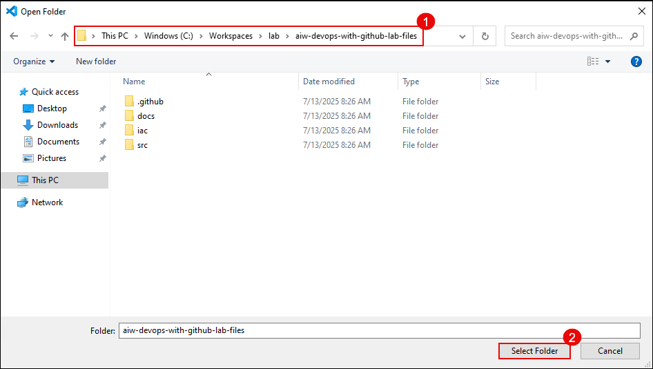
    
1. You may receive a prompt: Do you trust the authors of the files in this folder? select the **Checkbox** **(1)** the box and click on **Yes, I trust the authors** **(2)**.

   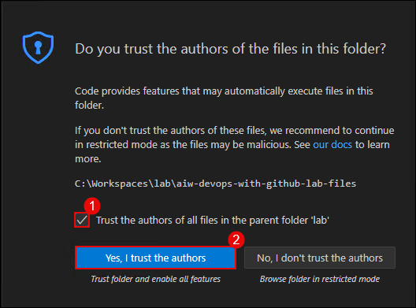
   
1. You'll see the lab files in Visual Studio Code and explore the code files.

   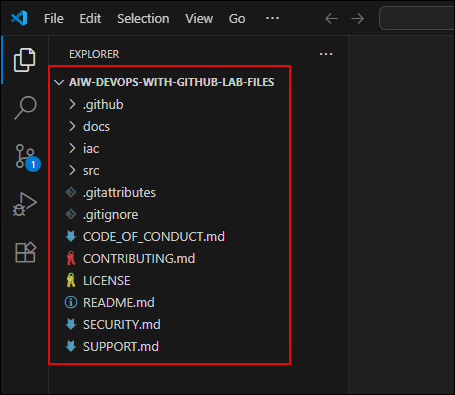

### Task 2: Set up Local Infrastructure

In this task, you will set up the local infrastructure using NET. You'll be working with three Docker images: fabrikam-init, fabrikam-api, and fabrikam-web.
   
1. In **Visual Studio Code**, open a new terminal by clicking on the **menu bar (1)**, selecting **Terminal (2)**, and then choosing **New Terminal (3)**.

   
   
1. Click on the **Drop-down** **(1)** button next to PowerShell and select **Command Prompt** **(2)**  from the list. A new Command Prompt terminal will be opened.   

   
   
1. Navigate to the **Environment (1)** details pane, click on **Service Principal Details (2)**, and copy the following values:

   - **Application ID (Client ID)**
   - **Secret Key (Client Secret)**
   -  **Tenant ID (Directory ID)**  
   
      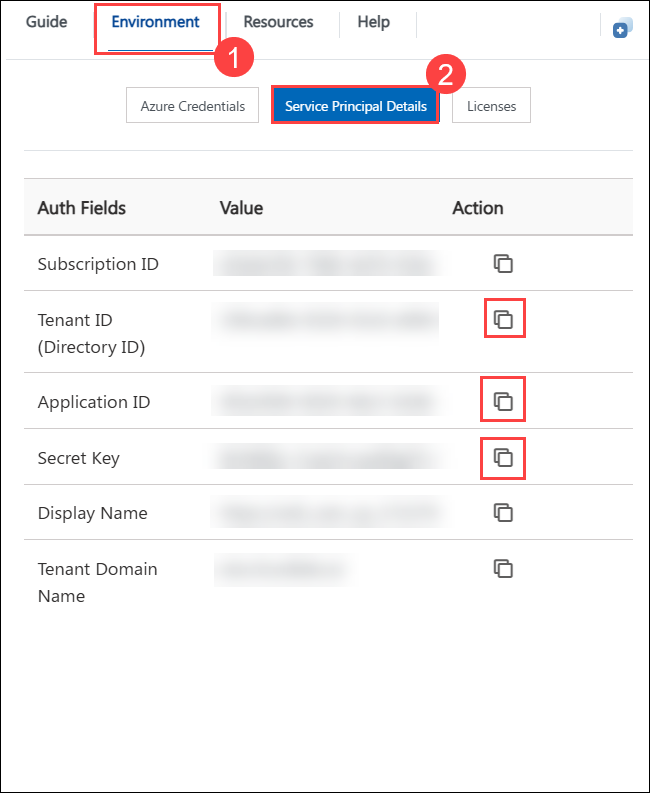
   
1. Update the **Application Id (Client Id)**, **Client Secret**, and **Tenant Id** in the command mentioned below. Run it in the terminal.

   ```pwsh
   az login --service-principal -u <clientId> -p=<clientSecret> --tenant <tenantId>
   ```

   

   >**Note:** Open Notepad, make the necessary updates to the command, then copy and paste the updated command into the terminal for execution.

1. Run the below-mentioned command to navigate to `ContosoTraders.Api.Products` folder.

   ```pwsh
   cd C:\Workspaces\lab\aiw-devops-with-github-lab-files\src\ContosoTraders.Api.Products
   ```
   
      
   
1. Run the below command to set the secret path.

   ```pwsh
   dotnet user-secrets set "KeyVaultEndpoint" "https://contosotraderskv<inject key="DeploymentID" />.vault.azure.net/"
   ```  

   
   
1. Run the below-mentioned command to build and host the carts locally.

   ```pwsh
   dotnet build && dotnet run --no-build
   ```  

    
   
   >**Note:** Please wait for 2 - 3 minutes for the build to complete.
   
1. Keep the terminal running. Open a new browser tab and try accessing the application using localhost port. You'll be able to see the output similar to the screenshot mentioned below.

   ```pwsh
   https://localhost:62300/swagger
   ```  

   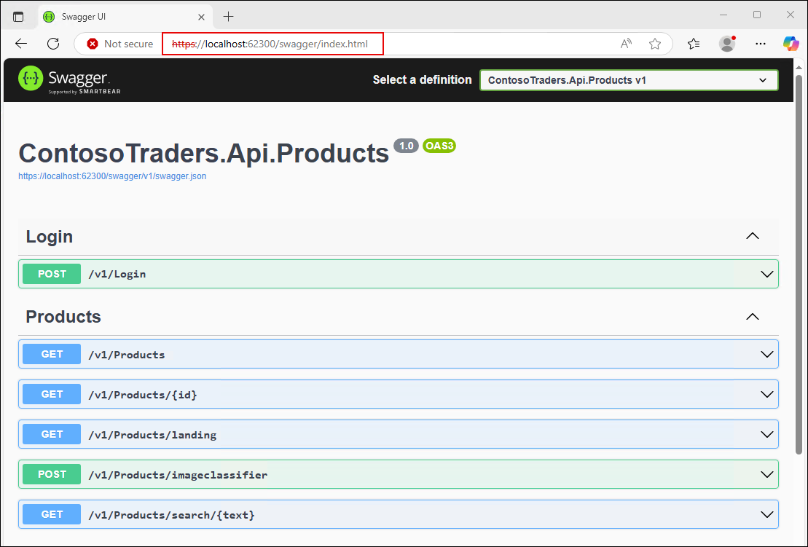     
   
   > **Note:** If you are not able to access the application, click on **Advanced** under Your connection isn't private.
       

     
   
   * Then click on Continue to localhost(unsafe) to access the application.

         
   
1. Navigate back to **VS Code** and stop the terminal by typing **Ctrl + C**. Run the below-mentioned command to navigate to `ContosoTraders.Api.Carts` folder. 
  
   ```pwsh
   cd C:\Workspaces\lab\aiw-devops-with-github-lab-files\src\ContosoTraders.Api.Carts
   ```
  
        
   
1. Run the below command to set the secret path.

   ```pwsh
   dotnet user-secrets set "KeyVaultEndpoint" "https://contosotraderskv<inject key="DeploymentID" />.vault.azure.net/
   ```

   
   
1. Run the below-mentioned command to build and host the carts locally.

   ```pwsh
   dotnet build && dotnet run --no-build
   ```    
  
    
   
   >**Note:** Please wait for 2 - 3 minutes for the build to complete.

1. Keep the terminal running. Open a new browser tab and try accessing the application using localhost port. You'll be able to see the output similar to the screenshot mentioned below.

   ```pwsh
   https://localhost:62400/swagger
   ```  

   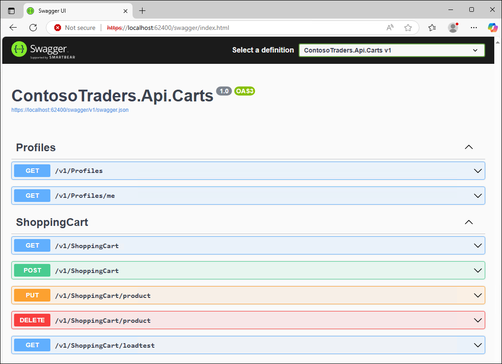
   
1. Navigate back to **VS Code** and stop the terminal by typing **Ctrl + C**.    
   
1. From the Windows taskbar, search for **Command Prompt** by typing **Command prompt (1)** in the search box, then click on **Command Prompt (2)** from the results to open it.

   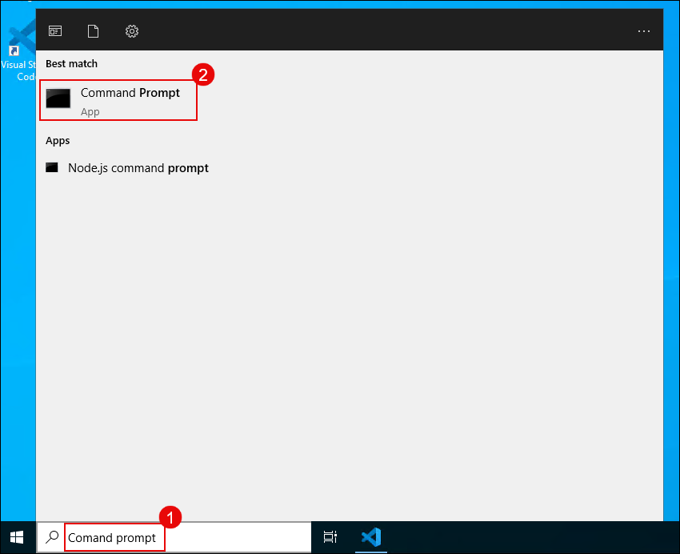    
   
1. Run the below-mentioned command to navigate to the `ContosoTraders.Ui.Website` folder. 
  
   ```pwsh
   cd C:\Workspaces\lab\aiw-devops-with-github-lab-files\src\ContosoTraders.Ui.Website
   ```
    
   
1. Run the below-mentioned command to install npm.

   ```pwsh
   npm ci
   ```    
  
    
   
   >**Note:** Please wait until the installation completes. It will take around 10 - 15 minutes when you run npm install for the first time. Incase the execution is stuck, Please use **Ctrl + C** to stop the execution and retry the step again.
   
1. Navigate back to **VS Code**, run the below-mentioned command to navigate to `ContosoTraders.Ui.Website` folder. 
  
   ```pwsh
   cd C:\Workspaces\lab\aiw-devops-with-github-lab-files\src\ContosoTraders.Ui.Website
   ```

1. Now run the following command to run ui of the application. This will automatically open a browser tab where you'll see the complete application running

   ```pwsh
   npm run start
   ```    
  
    
   
   >**Note:** It can take 5 - 10 minutes when you execute the command for the first time. You can continue with the next task and check on this step later.   
   
### Task 3: Create the Project Repo

In this task, you'll access the GitHub Enterprise account and create a new repository to store the infrastructure.

In this task, you will create an account on [GitHub](https://github.com) and use `git` to add lab files to a new repository.

1. In a new browser tab, go to `https://www.github.com/login`.

1. Navigate to the **Environment (1)** tab in the lab environment and click on the **Licenses (2)** button. Copy the **GitHub UserEmail (3)** and **GitHub Password (4)**, then save these credentials in **Notepad**. You will need them later during the GitHub login and device verification steps.

   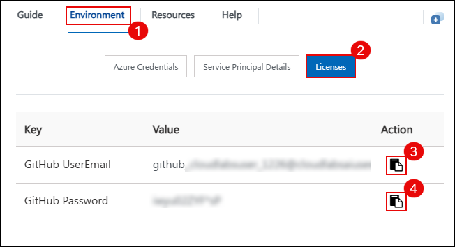

1. Open a **Private window** in Microsoft Edge by clicking the three-dot menu **(1)** in the top-right and selecting **New InPrivate window (2)**.

   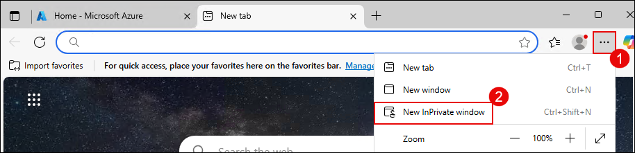

1. In the new InPrivate window, go to `http://outlook.office.com/`.

   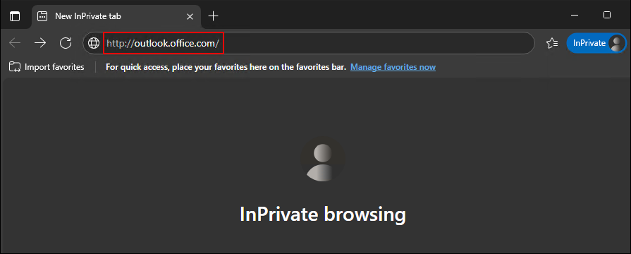

1. Enter your **GitHub Username (1)** (as saved in Notepad) and click **Next (2)** to proceed.

   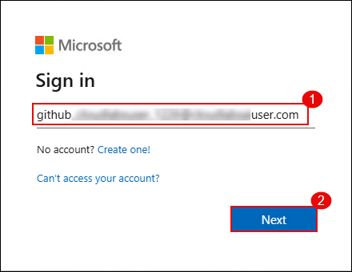

1. Enter your **GitHub Password (1)** (as saved in Notepad) and click **Sign in (2)**.

   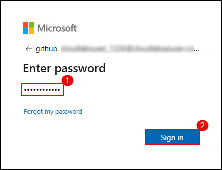

1. If you see the pop-up **Stay Signed in?**, select **No**.

   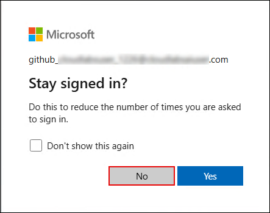

1. Check your email inbox and copy the **Verification code** sent by GitHub.

   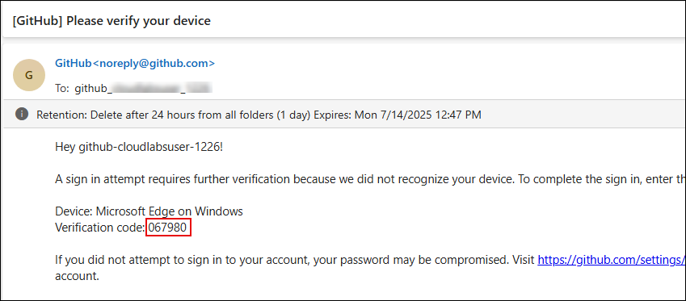
   
1. On the **Device verification** pane, enter the **Device Verification Code (1)** that was emailed to you and click **Verify (2)**.

   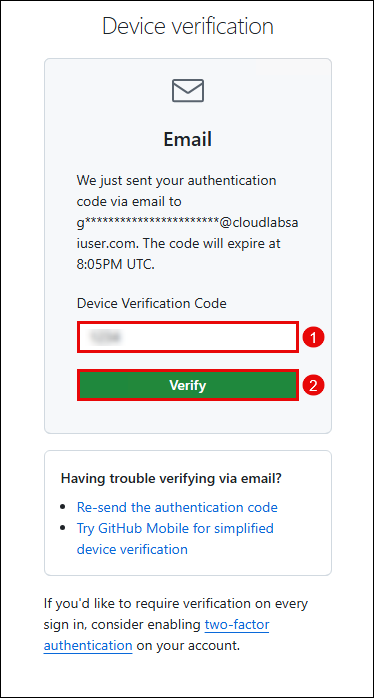 
   > **Note:** If you see **Two-factor authentication (2FA) is required for your GitHub account** page next, click on **Remind me tomorrow**
      


1. In the upper-right corner of the GitHub dashboard, click on your **Profile (1)** icon and select **Your repositories (2)** from the dropdown menu.

   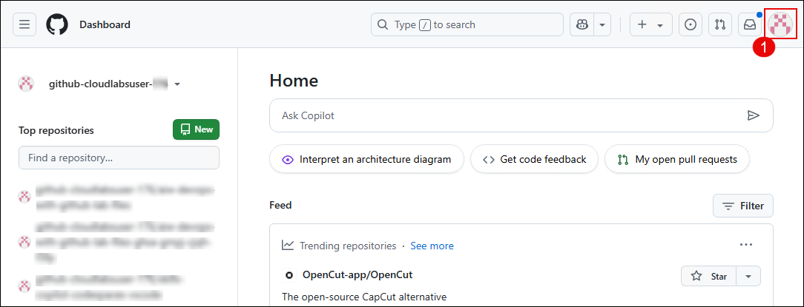
   
   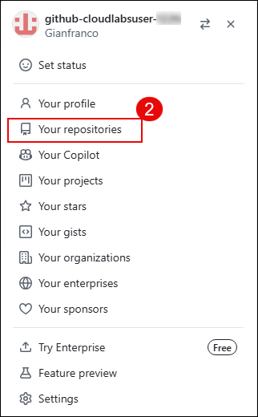

1. Next to the search criteria, locate and select the **New** button.

   

1. On the **Create a new repository** screen, name the repository ```aiw-devops-with-github-lab-files``` **(1)**, select **Public (2)** and click on **Create repository (3)**  button.

   
   
   >**Note:** If you observe any repository existing with the same name, please make sure you delete the Repo and create a new one. Please follow the step 13 to step 17. Else, skip to step 18.

1. In the upper-right corner of the GitHub dashboard, click on your **Profile (1)** icon and select **Your repositories (2)** from the dropdown menu.

   
   
   

1. Using the search bar, search for **```aiw-devops-with-github-lab-files``` (1)** and **select (2)** to open it.

   

1. From the GitHub repository, click on the **Settings** tab.

   

1. In the settings page, scroll to the bottom of the page and select **Delete this repository**.

   

1. Are you absolutely sure? pop up window, Copy the **Repository name** **(1)**, paste it in the **Box** **(2)**, and cick on **I understand the consequences, delete this repository** **(3)**.

   

1. On the **Quick setup** screen, copy the **HTTPS** GitHub URL for your new repository, and **Save it** in a notepad for future use.

   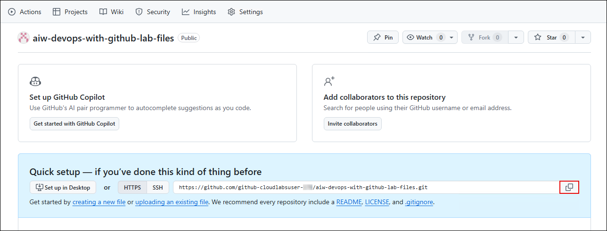
   
1. From the GitHub username, note down the **Unique-ID** present in the Username. You'll use this value in upcoming steps.

   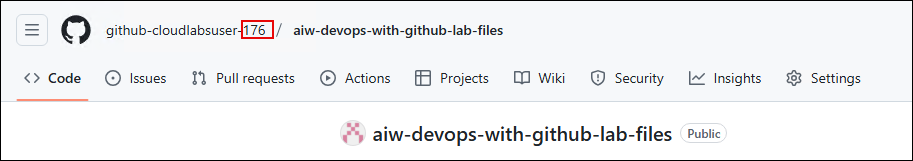 
   
1. Navigate back to the **Visual Studio Code** , ensure the terminal is open. Click on the **drop-down arrow (1)** next to the terminal tab, then select **PowerShell (2)** to open a new PowerShell terminal session.

   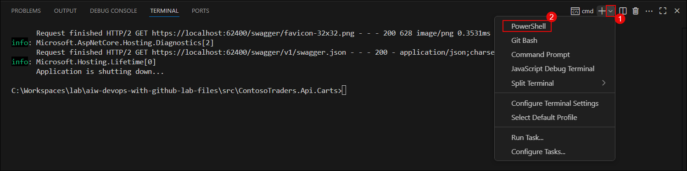 

1. In Visual Studio Code, run the following commands in the terminal to set your **Username** and **Email**, which Git uses for commits. Make sure to replace the GitHub account email and username.

   >**Note:** For the email format github_cloudlabsuser_xxx@xxx.com, the corresponding username will follow this format: github-cloudlabsuser-xxx
   
     ```pwsh
     cd C:\Workspaces\lab\aiw-devops-with-github-lab-files
     git config --global user.email "you@example.com"
     git config --global user.name "Your UserName"
     ```
     
    
   
1.  Run the below mentioned command in the terminal. Make sure to replace <your_github_repository-url> with the value you copied in step 11 and Unique-ID in step 12

    Note: This step is done to initialize the folder as a git repository, commit, and submit contents to the remote GitHub branch “main” in the lab files    repository created in Step 1. 

      ```pwsh
      git init
      git add .
      git commit -m "Initial commit"
      git branch -M main
      git remote add <Unique-ID> <your_github_repository-url>
      git push -u <Unique-ID> main
      ```
     
1.  You are asked to authenticate your GitHub account. Select **Sign in with your browser**.

       

1.  You will be prompted with a pop-up window to authorize Git Credential Manager. Click on **Authorize git-ecosystem** to provide access

       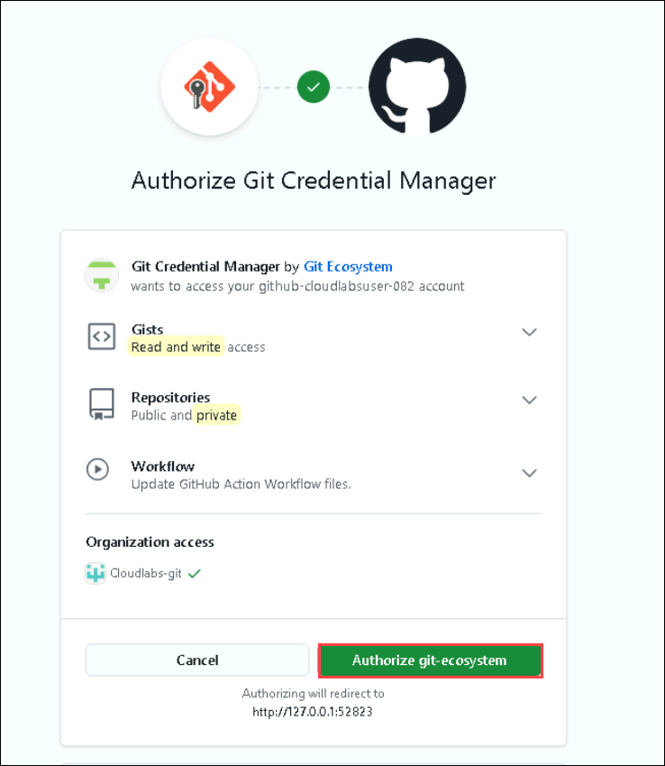

1.  After you are prompted with the message **Authorization Succeeded**, close the tab and continue with the next task.
   
   >**Note:** If you encounter any errors as shown below, please follow the steps outlined below.

   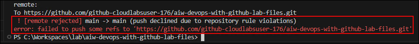

   (i) Scroll up within the terminal to locate the highlighted link. Click on the link.

   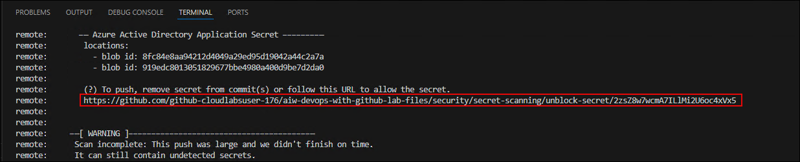

   (ii) Choose the **It's used in tests (1)** option. Then, select **Allow me to expose this secret (2)** to proceed.

   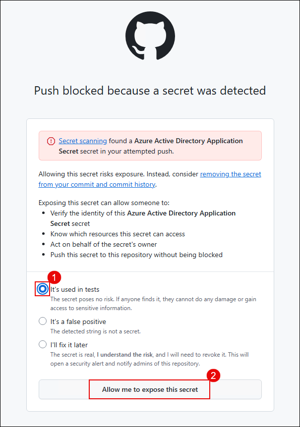   

   (iii) After completing the previous step, navigate back to VS Code and rerun step 13 to finish the push process. 

### Task 4: Build and push using GitHub Actions

In this exercise, you will build automation in GitHub for updating and republishing our Docker images when the code changes. You will create a workflow file using the GitHub interface and its GitHub Actions workflow editor. This will get you familiar with how to create and edit an action through the GitHub website.

1. From the Azure Portal dashboard, click on **Resource groups** from the navigation panel to view all available resource groups.

   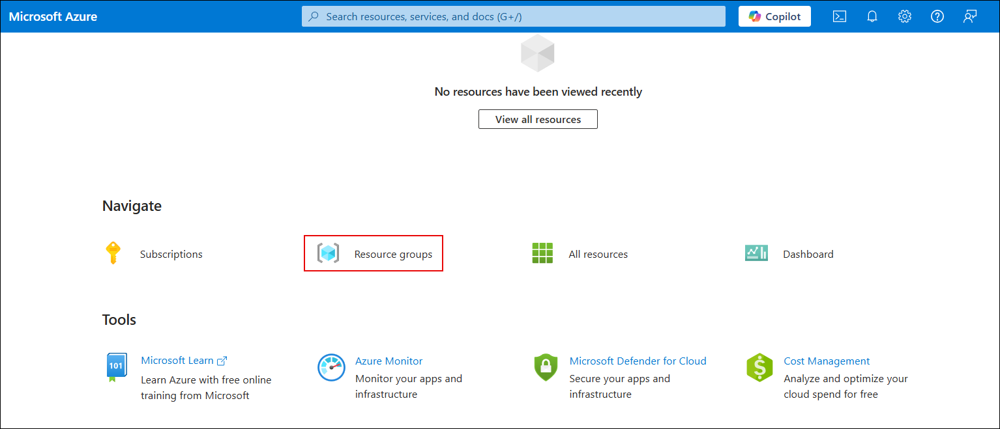 
   
1. Select **contoso-traders-<inject key="DeploymentID" enableCopy="false" />** resource group from the list.

     
   
1. Select **productsdb** SQL database from the list of resources.

    
   
1. In the **productsdb** SQL database page, expand **Settings (1)** from the left-hand menu, then select **Connection strings (2)**.  Under the **ADO.NET (3)** tab, copy the **ADO.NET (SQL authentication)** connection string by clicking the **copy icon (4)**.

   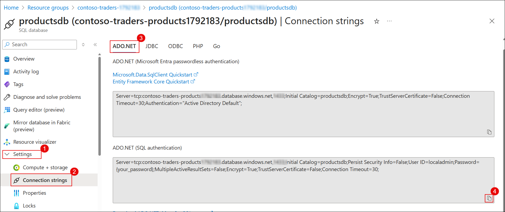  
 
1. In your GitHub lab files repository, select the **Settings** tab from the lab files repository.

   
   
1. Under **Security**, expand **Secrets and variables (1)** by clicking the drop-down and select **Actions (2)** blade from the left navigation bar. Select the **New repository secret (3)** button.

   
    
1. Under **Actions Secrets/New secret** page, enter the below-mentioned details.

   >**Note:** Replace `{your_password}` with the ODL User Azure Password. Go to **Environment Details (1)**, click on **Azure credentials (2)**, and copy **Password (3)**.
   
   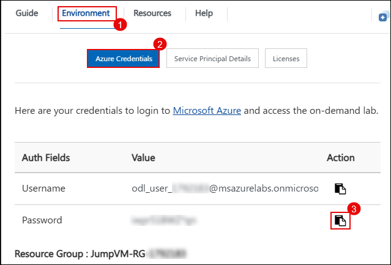   

   - **Name** : Enter **SQL_PASSWORD (1)**
   - **Secret** : Paste the **ADO.NET (SQL authentication) (2)** which you copied in previous step.
   - Click on **Add secret (3)**.
   
      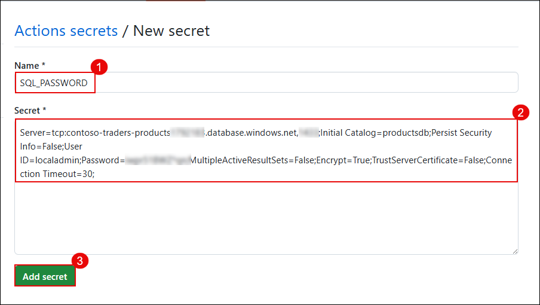
      
1. Navigate to the **Environment (1)** tab and click on **Service Principal Details (2)**. From the list, copy the following fields:

   - **Subscription ID**
   - **Tenant ID (Directory ID)**
   - **Application ID (Client ID)**
   - **Secret Key (Client Secret)**

      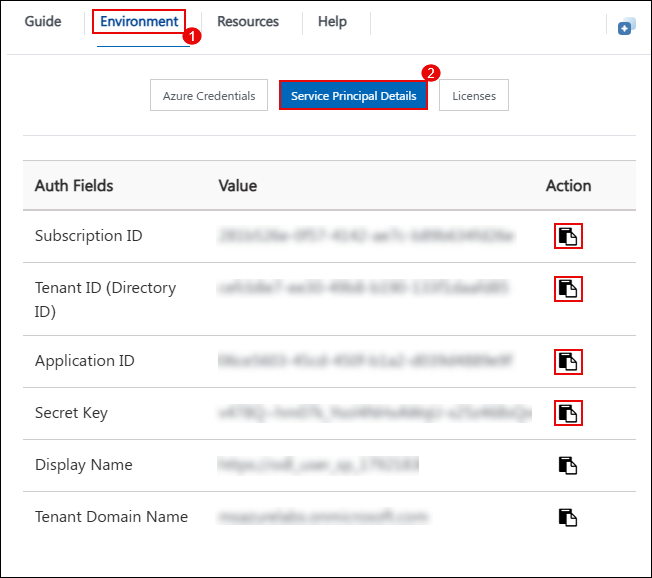
   
   - Replace the values that you copied below with JSON. You will be using them in this step.
   
      ```json
      {
         "clientId": "zzzzzzzz-zzzz-zzzz-zzzz-zzzzzzzzzzzz",
         "clientSecret": "client-secret",
         "tenantId": "zzzzzzzz-zzzz-zzzz-zzzz-zzzzzzzzzzzz",
         "subscriptionId": "zzzzzzzz-zzzz-zzzz-zzzz-zzzzzzzzzzzz"
      }
      ```
   
1. Select **New repository secret** and under **Actions Secrets/New secret** page, enter the below mentioned details and Click on **Add secret (3)**.

   - **Name** : Enter **SERVICEPRINCIPAL (1)**
   - **Secret** : Paste the service principal details in json format **(2)**
   
          
   
1. Select **New repository secret** and under **Actions Secrets/New secret** page, enter the below mentioned details and Click on **Add secret** **(3)**.

   - **Name** : Enter **ENVIRONMENT (1)**
   - **Secret**:**<inject key="DeploymentID" enableCopy="false" /> (2)**
   
      
   
1. From your GitHub repository, select the **Actions (1)** tab. Select the **contoso-traders-app-deployment (2)** workflow from the side blade, click on the  **drop-down (3)** next Run workflow button, and select **Run workflow (4)**.

   

1. Navigate back to the Actions tab and select the **contoso-traders-app-deployment** workflow. This workflow builds the docker image, which is pushed to container registry. The same image is pushed to the Azure container application.

   
   
   
   
   >**Note:** If the workflow **fails** due to **npm install** job, follow from step 13 - step 16. Else, continue from step 17. 
   
1. From the GitHub browser tab, follow the steps given below and click on **Create codespace on main (3)**.

   - Click on **Code (1)**, 
   - Select the **Codespace (2)** tab

      
 
      >**Note:** If prompted to **Install** an extension, please proceed with the installation and **Allow** any **Visual Studio** pop-ups that appear.

      > It will redirect you to the new tab of the browser. On the **Select user to authorize Visual Studio Code** page, select **Continue**. On the pop-u,p select **Open**.
   
1. Run the below-mentioned commands in the **Terminal**. You'll set node version to node 14.

   ```pwsh
   cd src
   cd ContosoTraders.Ui.Website
   nvm install 14
   nvm use 14
   npm i
   git add . 
   git commit -m "updated node version"
   git push
   ```
    
1. From your GitHub repository, select the **Actions (1)** tab. You'll see an Action named **Updated node version (2)** executing. Please wait until the execution completes

   
   
         
   
1. Navigate to **Azure Portal**, click on **Resource groups** from the Navigate panel to see the resource groups.

    
   
1. Select **contoso-traders-<inject key="DeploymentID" enableCopy="false" />** resource group from the list.

    
   
1. Select **contoso-traders-ui2<inject key="DeploymentID" enableCopy="false" />** endpoint from the list of resources.

    
   
1. Click on **Endpoint hostname**. It'll open a browser tab where you will see that the Contoso Traders app has been hosted successfully.

    
    
    
    
### Task 5: Editing the GitHub Workflow File using Codespace

The last task automated building and updating only one of the Docker images. In this task, we will update the workflow file with a more appropriate workflow for the structure of our repository. This task will end with a file named `docker-publish.yml` that will rebuild and publish Docker images as their respective code is updated.

1. From the GitHub browser tab, follow the steps given below and click on **Create codespace on main (3)**.

   - click on **Code (1)**, 
   - Select the **Codespace (2)** tab

   
   
   >**Note:** In case you had created a  codespace in the  previous task. Click on the **+** button to create a new codespace.
   
1. You will be redirected to a new Codespace tab in your browser. Click **Continue**.

   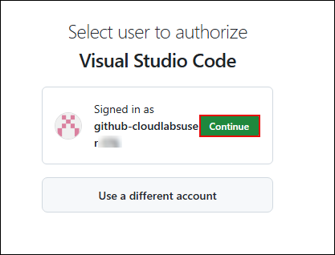

1. Allow the pop-up window, check the box to **always allow (1)** the lin,k and click **Open (2)** to launch Visual Studio Code

   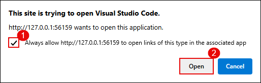

      >**Note:** If prompted to **Install** an extension, please proceed with the installation and **Allow** any **Visual Studio** pop-ups that appear.

      > You will be redirected to a new browser tab. On the Select user to authorize Visual Studio Code page, click Continue. When prompted, select Open in the pop-up window. Then, choose your GitHub account and click Continue.
      
1. From the explorer side blade, navigate to **.github (1)** -> **workflows** **(2)** and select **contoso-traders-provisioning-deployment.yml** **(3)** file.

   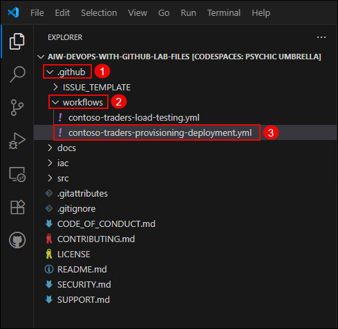 


1. Remove the commands from lines **7 to 14** from the workflow file.

   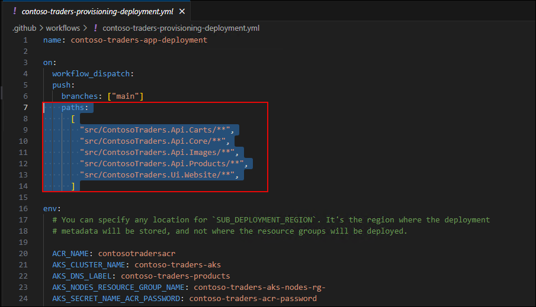

   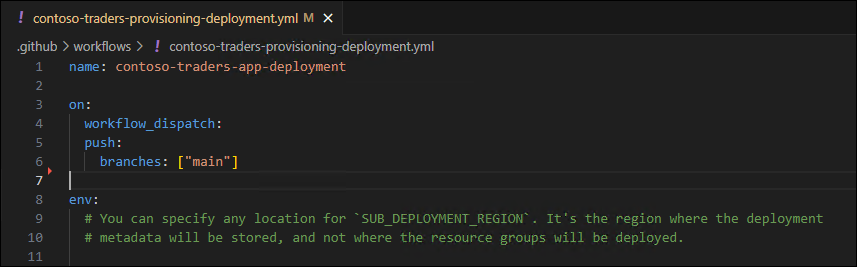 
   
   >**Note:** Press **CTRL + S**, to save the changes, if needed.

1. Using the terminal from Codespace, run the following commands to commit this change to your repo and to push the change to GitHub.

   ```pwsh
   git add .
   git commit -m "Updating app deployment"
   git push
   ```
   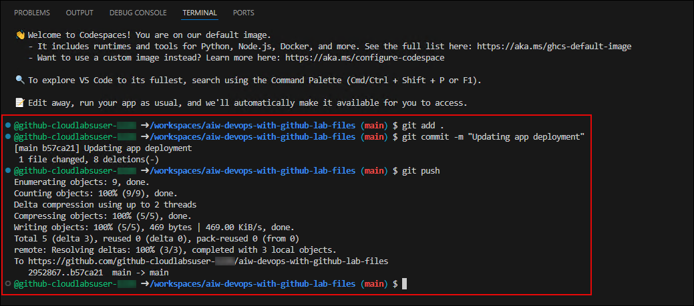
    
   > **Note:** This will update the workflow and will **not** run the "Update the ... Docker image" jobs.

1. Navigate back to the GitHub browser, select the **Actions (1)** tab, and review the **workflow (2)** in the summary section, created automatically for the changes made. 

   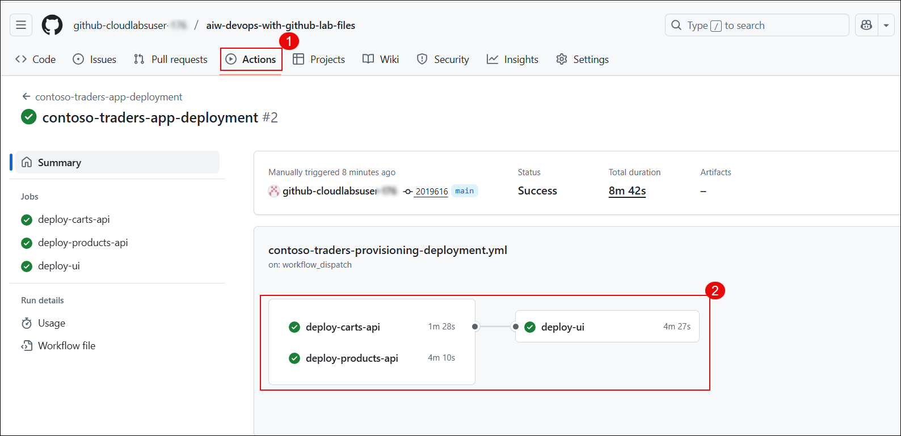

1. Click on the **Next** button present in the bottom-right corner of this lab guide.

## Summary

In this lab, you hosted the application locally, deployed the application to Azure using GitHub Actions, and explored Codespace.

### You have successfully completed the lab
